# Systemarkitektur — qlim8 app + landing, fra ende til anden

> Status: stabil · Sidst opdateret: 2026-06-29 · Ejer: qlim8-teamet

> ℹ️ **Synkroniseret kopi.** Denne arkitektur-reference vedligeholdes i **qlim8-app**-repoet
> ([`docs/da/architecture/system-architecture.md`](https://github.com/madsdlund-nielsen/qlim8-app/blob/main/docs/da/architecture/system-architecture.md)),
> som er kilden (system of record). Kopieret hertil så landing-repoet også dokumenterer hele
> systemet. Sidst synkroniseret: 2026-06-29.

## Overblik

Dette dokument er den **visuelle reference** for hele qlim8-produktet: klimaregnskabs-SaaS'en
(`qlim8-app`, **app.qlim8.com**) og marketing-sitet (`qlim8-landing`, **qlim8.com**). Det
supplerer prosaen i [`overview.md`](https://github.com/madsdlund-nielsen/qlim8-app/blob/main/docs/da/architecture/overview.md), [`data-flow.md`](https://github.com/madsdlund-nielsen/qlim8-app/blob/main/docs/da/architecture/data-flow.md) og
[`deployment.md`](https://github.com/madsdlund-nielsen/qlim8-app/blob/main/docs/da/architecture/deployment.md) med et lagdelt sæt diagrammer — fra et landskab i fugleperspektiv
ned til enkelte request-flows.

Diagrammerne er skrevet i [Mermaid](https://mermaid.js.org) og renderes inline på GitHub. Hvert
diagram er også eksporteret til **SVG, PNG og Excalidraw** under
[`../../diagrams/`](../../diagrams/README.md); `.mmd`-filerne dér er den redigerbare kilde
(source of truth). Se mappens README for hvordan eksporterne regenereres.

> **Konvention:** diagram-**labels er på engelsk/teknisk** (rute-navne, service-navne), og ét
> fælles billedsæt deles mellem dette dokument og dets engelske tvilling
> [`../../en/architecture/system-architecture.md`](../../en/architecture/system-architecture.md);
> kun den omkringliggende prosa er oversat.

## Sådan læses dokumentet

Læs oppefra og ned — hvert afsnit zoomer ind:

1. **Systemkontekst** — hvem bruger hvad, og alle eksterne afhængigheder.
2. **App-runtime** — request-livscyklussen inde i den ene server-proces.
3. **Public API & agent-flade** — v1 / MCP / OAuth-trioen (et produkt-differentiator).
4. **Domænemodel** — det ~80-tabellers skema, grupperet efter bounded context.
5. **Landing & app-broer** — hvordan marketing-sitet afleverer til app'en.
6. **Deployment & CI/CD** — hvor det hele kører.
7. **Nøgleflows** — sekvensdiagrammer for de bærende scenarier.
8. **Arkitektur-noter & kendte huller** — det et diagram alene kan vildlede om.

### Signaturforklaring

| Stil | Betydning |
|---|---|
| 🟦 Blå | Intern qlim8-komponent |
| 🟪 Lilla | Menneskelig persona / aktør |
| ⬜ Grå, stiplet kant | Ekstern SaaS / tredjepart |
| 🟩 Grøn cylinder | Datalager |
| 🟧 Orange | Sikkerheds-/auth-grænse |
| 🟥 Rød, stiplet | Kendt hul / forbehold |
| Stiplet kant | Asynkron / proxy'et / out-of-band |

---

## 1. Systemkontekst

Landskabet: begge produkter, alle menneskelige personaer, AI-agent-connectors og alle eksterne
tjenester. Dette ene diagram fungerer også som det overordnede overblik.

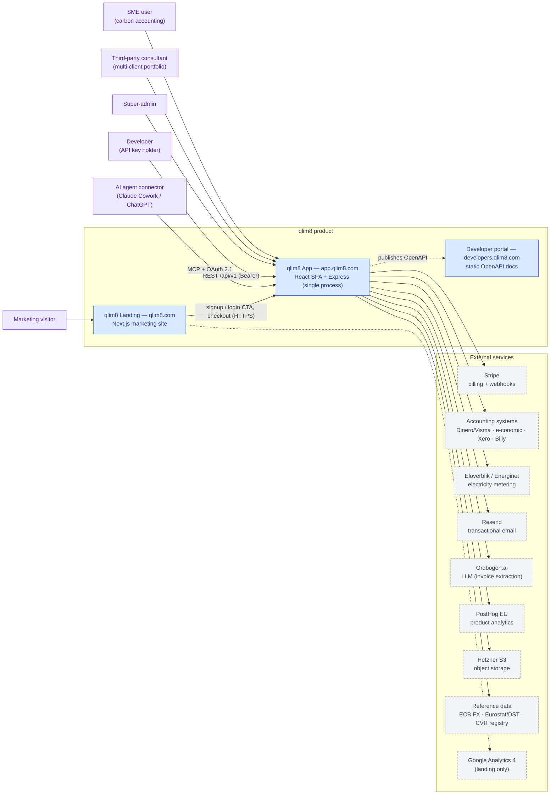

_Eksporter: [SVG](../../diagrams/svg/01-system-context.svg) · [PNG](../../diagrams/png/01-system-context.png) · [Mermaid](../../diagrams/mmd/01-system-context.mmd) · [Excalidraw](../../diagrams/excalidraw/01-system-context.excalidraw)_

De to produkter er **separate deployments**, der kun forbindes over offentlig HTTPS
(signup/login-CTA'er og Stripe-checkout). Alle produktdata ligger i EU (Hetzner Tyskland).

---

## 2. App-runtime / container-arkitektur

Request-livscyklussen inde i app'en. Det vigtigste dette diagram fortæller: **SPA'en, alle fire
API-flader og alle baggrundsworkere kører i én PM2 fork-proces** på port 5000 — der er ingen
separat worker-tier.

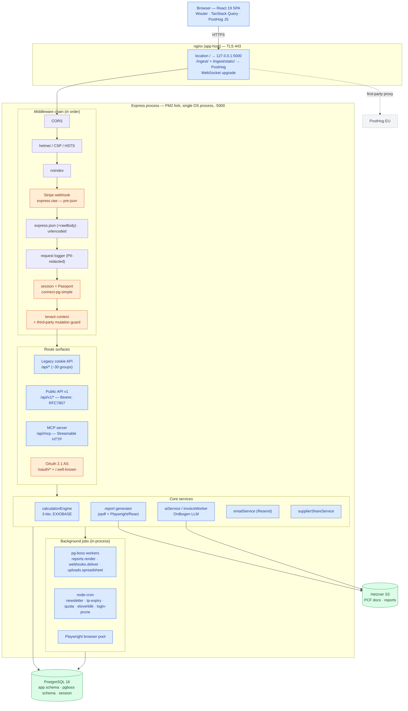

_Eksporter: [SVG](../../diagrams/svg/02-app-runtime.svg) · [PNG](../../diagrams/png/02-app-runtime.png) · [Mermaid](../../diagrams/mmd/02-app-runtime.mmd) · [Excalidraw](../../diagrams/excalidraw/02-app-runtime.excalidraw)_

Noter:
- **Stripe-webhooken er monteret før `express.json()`**, så den rå body er tilgængelig til
  signaturverifikation — den ligger uden for den normale JSON-sti (se `server/index.ts`).
- **nginx proxy'er PostHog first-party** via `/ingest/` (events) og `/ingest/static/`
  (SDK-assets); browseren taler aldrig direkte med PostHog, hvilket gør analytics
  ad-blocker-resistent.
- Baggrundsworkere startes i `httpServer.listen`-callbacket — samme proces, samme hukommelse.

---

## 3. Public API & AI-agent-flade

Et zoom på **v1 + MCP + OAuth**-trioen. qlim8 er sin **egen OAuth 2.1 Identity Provider** — der
er ingen ekstern IdP — hvilket lader AI-connectors (Claude Cowork, ChatGPT) autentificere og
betjene MCP-værktøjerne. v1 og MCP deler samme bearer-auth og rate-limiting-kode.

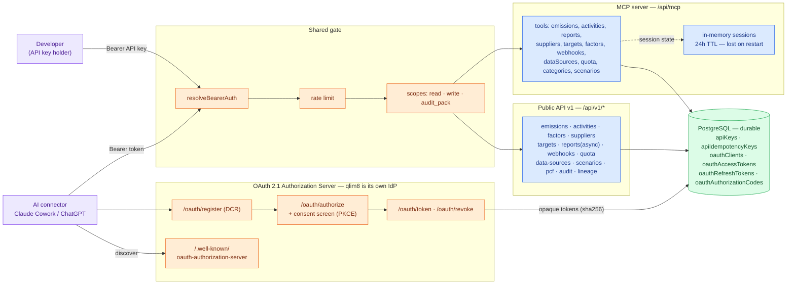

_Eksporter: [SVG](../../diagrams/svg/03-api-agent-surface.svg) · [PNG](../../diagrams/png/03-api-agent-surface.png) · [Mermaid](../../diagrams/mmd/03-api-agent-surface.mmd) · [Excalidraw](../../diagrams/excalidraw/03-api-agent-surface.excalidraw)_

**OAuth-tokens er varige** (uigennemsigtige sha256-hashes i Postgres); **MCP-sessioner er
flygtige** (i hukommelsen, 24t, geninitialiseres efter en genstart). Forveksl dem ikke.

---

## 4. Domænemodel

Skemaet er ~80 tabeller. Diagram 4a grupperer dem i bounded contexts (hver forretningsrække er
scoped til `tenants`); 4b og 4c viser de to mest værdifulde domæner i detaljer.

### 4a. Bounded contexts

```mermaid
flowchart TB
  tenants[("tenants<br/>root — every row scoped here")]

  subgraph auth["Auth & multi-tenancy"]
    a1["users · departments · sessions<br/>loginHistory · mfaTrustedDevices<br/>mfaRecoveryCodes · passwordResetTokens<br/>emailVerificationCodes · tenantTeamInvitations"]
  end
  subgraph carbon["Carbon accounting core"]
    c1["activities · activitySplits · emissionEntries<br/>emissionEntryCategoryChanges · dataSources<br/>emissionFactors · countryEmissionFactors<br/>emissionCategories · unitConversions<br/>priceIndices · currencyRates · categoryCorrections"]
  end
  subgraph reduce["Reduction & scenarios"]
    r1["reductionGoals · reductionTargets<br/>scenarios · tiltag · activityOntology<br/>auditLog · dismissedRecommendations"]
  end
  subgraph rep["Reporting & compliance"]
    rp1["generatedReports · apiReportJobs<br/>reportAttestations"]
  end
  subgraph tp["Third-party consultant"]
    t1["thirdPartyAccessGrants<br/>ledgerCommentThreads · ledgerComments<br/>ledgerCommentReads"]
  end
  subgraph scope3["Supplier / Scope 3"]
    sc1["supplierConnections"]
  end
  subgraph bill["Billing & quota"]
    b1["invoiceBatches · invoiceQueueItems<br/>quota periods · quota purchases"]
  end
  subgraph pcf["PCF / EPD"]
    p1["pcfDocuments · pcfExtractionDrafts<br/>pcfRecords"]
  end
  subgraph notif["Notifications & audit"]
    n1["notifications · auditEvents · announcements<br/>userAnnouncementSeen · userVersionSeen"]
  end
  subgraph api["Public API & OAuth"]
    ap1["apiKeys · apiIdempotencyKeys<br/>webhooks · webhookDeliveries<br/>oauthClients · oauthAccessTokens<br/>oauthRefreshTokens · oauthAuthorizationCodes"]
  end

  tenants --- auth
  tenants --- carbon
  tenants --- reduce
  tenants --- rep
  tenants --- tp
  tenants --- scope3
  tenants --- bill
  tenants --- pcf
  tenants --- notif
  tenants --- api

  classDef store fill:#dcfce7,stroke:#16a34a,color:#14532d;
  classDef internal fill:#dbeafe,stroke:#2563eb,color:#1e3a8a;
  class tenants store;
  class a1,c1,r1,rp1,t1,sc1,b1,p1,n1,ap1 internal;
```

_Eksporter: [SVG](../../diagrams/svg/04a-data-model-domains.svg) · [PNG](../../diagrams/png/04a-data-model-domains.png) · [Mermaid](../../diagrams/mmd/04a-data-model-domains.mmd) · [Excalidraw](../../diagrams/excalidraw/04a-data-model-domains.excalidraw)_

Se den fulde tabelliste i [`../reference/database-schema.md`](https://github.com/madsdlund-nielsen/qlim8-app/blob/main/docs/da/reference/database-schema.md).

### 4b. Carbon accounting core (detaljeret)

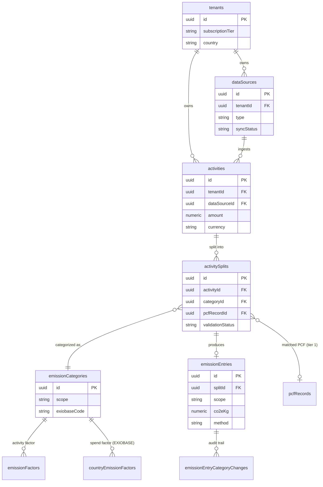

_Eksporter: [SVG](../../diagrams/svg/04b-data-model-carbon-core.svg) · [PNG](../../diagrams/png/04b-data-model-carbon-core.png) · [Mermaid](../../diagrams/mmd/04b-data-model-carbon-core.mmd) · [Excalidraw](../../diagrams/excalidraw/04b-data-model-carbon-core.excalidraw)_

### 4c. Public API & OAuth-lager (detaljeret)

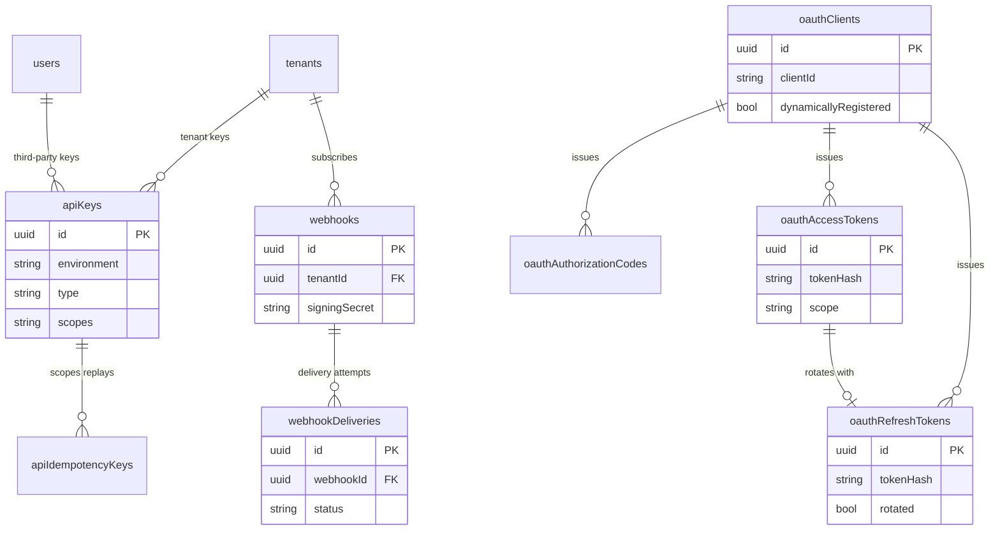

_Eksporter: [SVG](../../diagrams/svg/04c-data-model-public-api.svg) · [PNG](../../diagrams/png/04c-data-model-public-api.png) · [Mermaid](../../diagrams/mmd/04c-data-model-public-api.mmd) · [Excalidraw](../../diagrams/excalidraw/04c-data-model-public-api.excalidraw)_

---

## 5. Landing-arkitektur & app-broer

Hvordan marketing-sitet er bygget, og præcis hvor det afleverer til app'en.

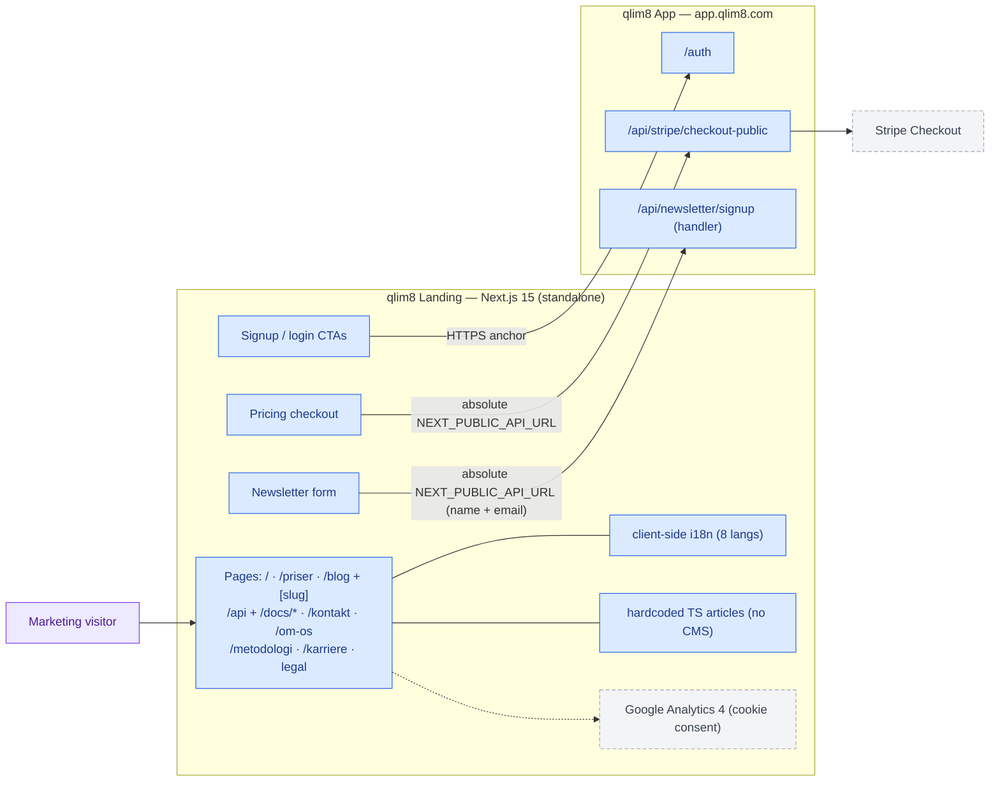

_Eksporter: [SVG](../../diagrams/svg/06-landing-bridges.svg) · [PNG](../../diagrams/png/06-landing-bridges.png) · [Mermaid](../../diagrams/mmd/06-landing-bridges.mmd) · [Excalidraw](../../diagrams/excalidraw/06-landing-bridges.excalidraw)_

> ✅ **Rettet.** `NewsletterForm.tsx` og `NewsletterSignupDialog.tsx` POST'er nu til den
> **absolutte** app-URL (`NEXT_PUBLIC_API_URL ?? https://app.qlim8.com`) — samme mønster som
> pricing-checkout — så requestet rammer app'ens `/api/newsletter/signup`-handler (CORS tillader
> allerede `qlim8.com`-origin). Den email-only dialog sender nu også det påkrævede `name`.
> Tidligere POST'ede den til en relativ sti, der endte blindt i Next-serveren. Se note 1 i §8.

Mappen `legacy/` i landing-repoet er en backup fra før omskrivningen og er bevidst udeladt.

---

## 6. Deployment & CI/CD-topologi

To **uafhængige** deployments på Hetzner (Tyskland), hver med sin egen nginx, certbot og
release-pipeline. De deler hverken database eller internt netværk — kun offentlig HTTPS + Stripe.

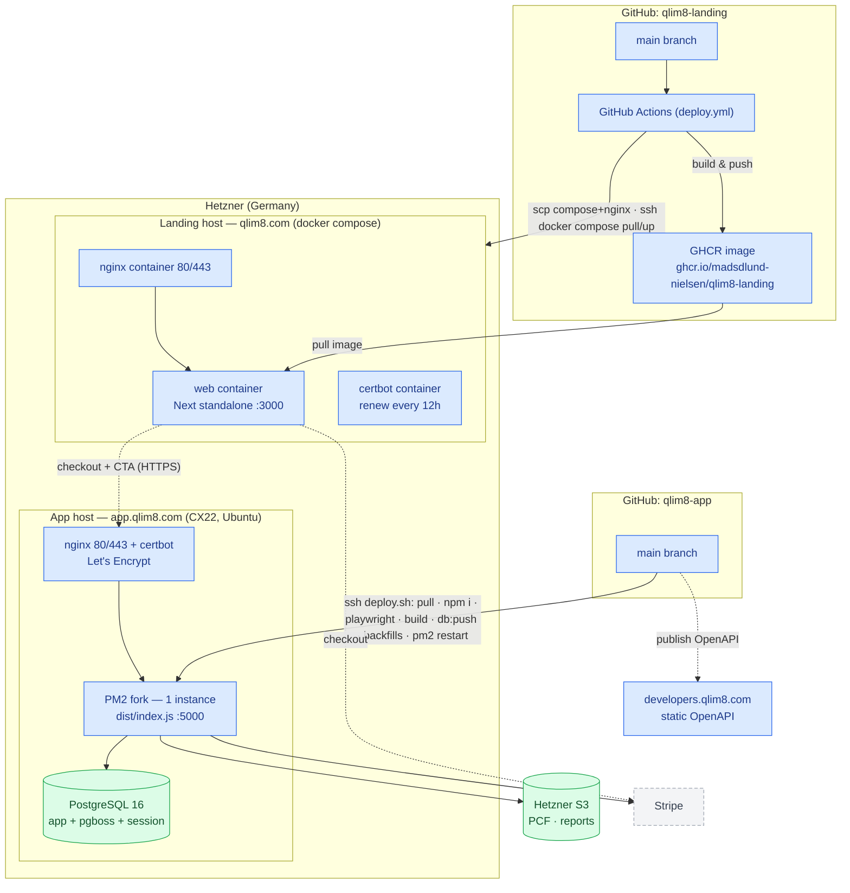

_Eksporter: [SVG](../../diagrams/svg/05-deployment.svg) · [PNG](../../diagrams/png/05-deployment.png) · [Mermaid](../../diagrams/mmd/05-deployment.mmd) · [Excalidraw](../../diagrams/excalidraw/05-deployment.excalidraw)_

- **App'en** udrulles via `deploy.sh` over SSH (`git pull → npm install → playwright install →
  npm run build → npm run db:push --force → backfills → pm2 restart`) og publicerer derefter
  OpenAPI-snapshottet til den statiske developer-portal.
- **Landing** udrulles via GitHub Actions: byg et multi-stage Alpine/Node 22 standalone-image →
  push til GHCR → SCP `docker-compose.yml`+`nginx.conf` → SSH `docker compose pull web && up -d`.

---

## 7. Nøgleflows

### 7.1 Faktura-indtag → AI → 3-tier-beregning → emissionspost

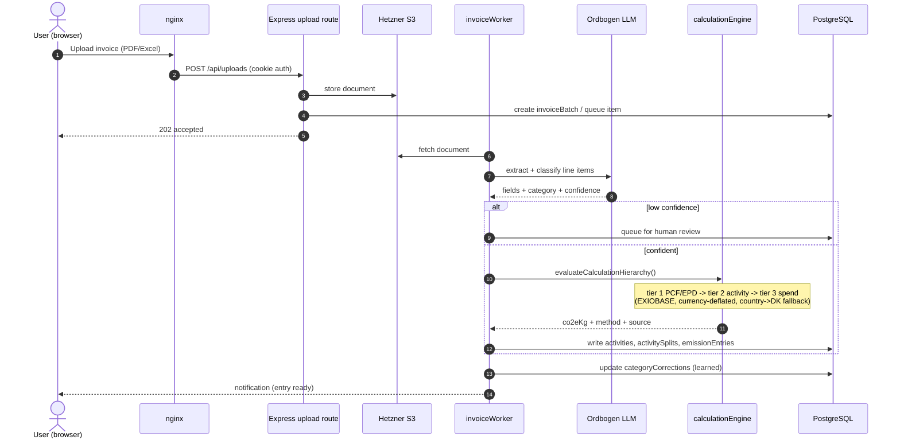

_Eksporter: [SVG](../../diagrams/svg/07-seq-invoice.svg) · [PNG](../../diagrams/png/07-seq-invoice.png) · [Mermaid](../../diagrams/mmd/07-seq-invoice.mmd) · [Excalidraw](../../diagrams/excalidraw/07-seq-invoice.excalidraw)_

### 7.2 Pricing-checkout-bro (landing → app → Stripe)

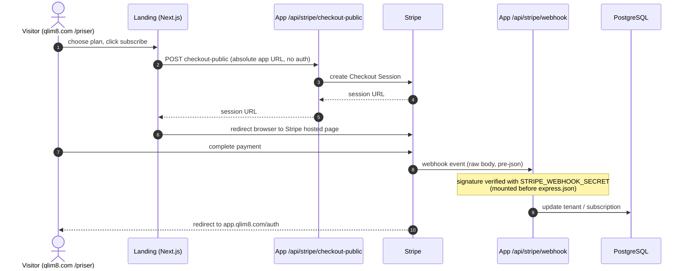

_Eksporter: [SVG](../../diagrams/svg/08-seq-checkout.svg) · [PNG](../../diagrams/png/08-seq-checkout.png) · [Mermaid](../../diagrams/mmd/08-seq-checkout.mmd) · [Excalidraw](../../diagrams/excalidraw/08-seq-checkout.excalidraw)_

### 7.3 OAuth 2.1 / MCP connector-auth

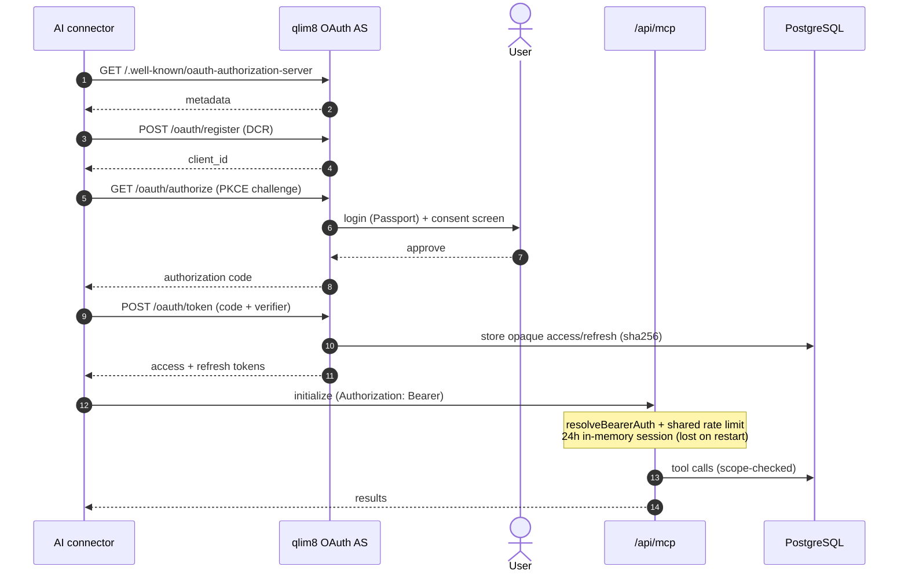

_Eksporter: [SVG](../../diagrams/svg/09-seq-oauth-mcp.svg) · [PNG](../../diagrams/png/09-seq-oauth-mcp.png) · [Mermaid](../../diagrams/mmd/09-seq-oauth-mcp.mmd) · [Excalidraw](../../diagrams/excalidraw/09-seq-oauth-mcp.excalidraw)_

### 7.4 Asynkront v1-rapportjob (pg-boss)

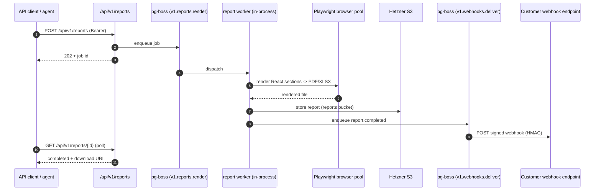

_Eksporter: [SVG](../../diagrams/svg/10-seq-report-job.svg) · [PNG](../../diagrams/png/10-seq-report-job.png) · [Mermaid](../../diagrams/mmd/10-seq-report-job.mmd) · [Excalidraw](../../diagrams/excalidraw/10-seq-report-job.excalidraw)_

---

## 8. Arkitektur-noter & kendte huller

1. **Nyhedsbrev-broen — rettet.** Landing-formularerne POST'er nu til den **absolutte** app-URL
   (`NEXT_PUBLIC_API_URL ?? https://app.qlim8.com`) og rammer app'ens `/api/newsletter/signup`-handler;
   den email-only dialog sender nu også det påkrævede `name`. (Tidligere endte en relativ
   `/api/newsletter/signup` blindt i Next-serveren — ingen handler, ingen `/api`-proxy.)
2. **Én proces.** Statisk SPA-servering, alle fire API-flader, alle workere og Playwright-poolen
   lever i én PM2 fork-instans. Der er ingen separat worker-/render-service.
3. **pg-boss er ikke separat infrastruktur.** Den kører i app'ens PostgreSQL under `pgboss`-skemaet.
4. **qlim8 er sin egen OAuth-IdP** (consent-skærm + dynamic client registration + PKCE). Ingen
   Auth0/Google; alle tokens og samtykke ligger i EU-Postgres (GDPR).
5. **First-party PostHog-proxy** via app-nginx `/ingest/` (events) + `/ingest/static/` (assets).
6. **Stripe-webhooken omgår JSON-body-parseren** (rå body, registreret først).
7. **To deployments, kun forbundet via offentlig HTTPS + Stripe.** Ingen delt DB eller internt
   netværk. To nginx-instanser og to certbots (bare-metal vs. dockeriseret). Landing-analytics er
   GA4; app-analytics er PostHog.
8. **Multi-tenancy + konsulent-kontekst.** Tenant-isolation via `resolveTenantContext`;
   konsulenter skifter klient med headeren `X-Client-Tenant-Id`; en `thirdPartyMutationGuard`
   nægter skrivninger for `third_party`-brugere undtagen en allow-list.
9. **MCP-sessioner er flygtige** (i hukommelsen, 24t, tabt ved genstart), mens OAuth-/API-tokens
   er varige i Postgres.
10. **Rapportgenerering er to-sporet:** legacy jspdf-generatorer (standard/CSRD/VSME) og den nyere
    Playwright + React-sektionsrenderer (via browser-poolen).
11. **3-tier-beregningens fallback:** PCF/EPD (leverandørspecifik) → aktivitetsfaktor →
    spend-baseret EXIOBASE, med country→DK-faktor-fallback og inflationskorrektion (HICP/CPI).

## Relaterede dokumenter

- [`architecture/overview.md`](https://github.com/madsdlund-nielsen/qlim8-app/blob/main/docs/da/architecture/overview.md)
- [`architecture/data-flow.md`](https://github.com/madsdlund-nielsen/qlim8-app/blob/main/docs/da/architecture/data-flow.md)
- [`architecture/deployment.md`](https://github.com/madsdlund-nielsen/qlim8-app/blob/main/docs/da/architecture/deployment.md)
- [`architecture/auth-and-tenancy.md`](https://github.com/madsdlund-nielsen/qlim8-app/blob/main/docs/da/architecture/auth-and-tenancy.md)
- [`architecture/security-and-gdpr.md`](https://github.com/madsdlund-nielsen/qlim8-app/blob/main/docs/da/architecture/security-and-gdpr.md)
- [`reference/database-schema.md`](https://github.com/madsdlund-nielsen/qlim8-app/blob/main/docs/da/reference/database-schema.md)
- [Diagram-kilder & eksporter](../../diagrams/README.md)
