# System architecture — qlim8 app + landing, end to end

> Status: stable · Last updated: 2026-06-29 · Owner: qlim8 team

> ℹ️ **Synced copy.** This architecture reference is maintained in the **qlim8-app** repository
> ([`docs/en/architecture/system-architecture.md`](https://github.com/madsdlund-nielsen/qlim8-app/blob/main/docs/en/architecture/system-architecture.md)),
> which is the system of record. It is copied here so the landing repo also documents the whole
> system. Last synced: 2026-06-29.

## Overview

This document is the **visual reference** for the whole qlim8 product: the carbon-accounting
SaaS application (`qlim8-app`, **app.qlim8.com**) and the marketing site (`qlim8-landing`,
**qlim8.com**). It complements the prose in [`overview.md`](https://github.com/madsdlund-nielsen/qlim8-app/blob/main/docs/en/architecture/overview.md),
[`data-flow.md`](https://github.com/madsdlund-nielsen/qlim8-app/blob/main/docs/en/architecture/data-flow.md) and [`deployment.md`](https://github.com/madsdlund-nielsen/qlim8-app/blob/main/docs/en/architecture/deployment.md) with a layered set of
diagrams, from a one-glance landscape down to individual request flows.

Diagrams are written in [Mermaid](https://mermaid.js.org) and render inline on GitHub. Every
diagram is also exported to **SVG, PNG and Excalidraw** under
[`../../diagrams/`](../../diagrams/README.md); the `.mmd` files there are the editable source of
truth. See that folder's README to regenerate the exports.

> **Convention:** diagram **labels are English/technical** (route names, service names) and a
> single shared image set is referenced by both this file and its Danish twin
> [`../../da/architecture/system-architecture.md`](../../da/architecture/system-architecture.md);
> only the surrounding prose is translated.

## How to read this document

Work top to bottom — each section zooms in:

1. **System context** — who uses what, and every external dependency.
2. **App runtime** — the request lifecycle inside the single server process.
3. **Public API & agent surface** — the v1 / MCP / OAuth triad (a product differentiator).
4. **Domain data model** — the ~80-table schema, grouped by bounded context.
5. **Landing & app bridges** — how the marketing site hands off to the app.
6. **Deployment & CI/CD** — where it all runs.
7. **Key flows** — sequence diagrams for the load-bearing scenarios.
8. **Architectural notes & known gaps** — the things a diagram alone could mislead you on.

### Legend

| Style | Meaning |
|---|---|
| 🟦 Blue | Internal qlim8 component |
| 🟪 Purple | Human persona / actor |
| ⬜ Grey, dashed border | External SaaS / third-party |
| 🟩 Green cylinder | Data store |
| 🟧 Orange | Security / auth boundary |
| 🟥 Red, dashed | Known gap / caveated edge |
| Dashed edge | Asynchronous / proxied / out-of-band |

---

## 1. System context

The landscape: both products, all human personas, AI-agent connectors, and every external
service. This single diagram also serves as the high-level overview.

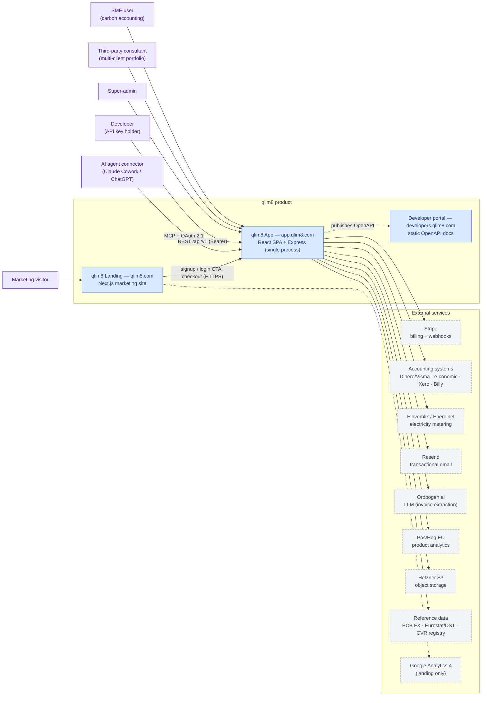

_Exports: [SVG](../../diagrams/svg/01-system-context.svg) · [PNG](../../diagrams/png/01-system-context.png) · [Mermaid](../../diagrams/mmd/01-system-context.mmd) · [Excalidraw](../../diagrams/excalidraw/01-system-context.excalidraw)_

The two products are **separate deployments** that bridge only over public HTTPS (signup/login
CTAs and Stripe checkout). All product data lives in the EU (Hetzner Germany).

---

## 2. App runtime / container architecture

The request lifecycle inside the app. The most important thing this diagram says: **the SPA,
all four API surfaces, and every background worker run in a single PM2 fork process** on port
5000 — there is no separate worker tier.

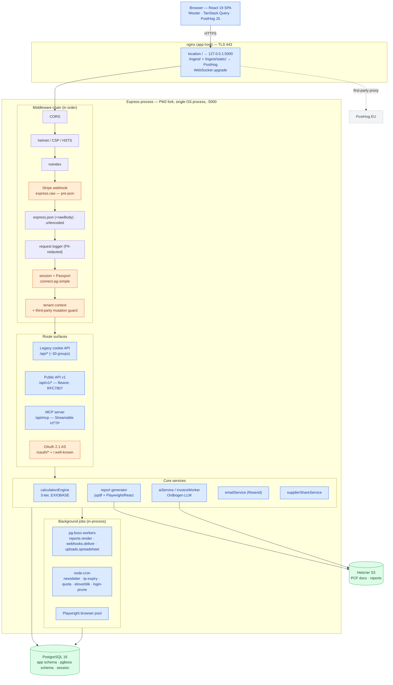

_Exports: [SVG](../../diagrams/svg/02-app-runtime.svg) · [PNG](../../diagrams/png/02-app-runtime.png) · [Mermaid](../../diagrams/mmd/02-app-runtime.mmd) · [Excalidraw](../../diagrams/excalidraw/02-app-runtime.excalidraw)_

Notes:
- The **Stripe webhook is mounted before `express.json()`** so the raw body is available for
  signature verification — it sits outside the normal JSON path (see `server/index.ts`).
- **nginx proxies PostHog first-party** via `/ingest/` (events) and `/ingest/static/` (SDK
  assets); the browser never talks to PostHog directly, which keeps analytics ad-blocker-resistant.
- Background workers are started in the `httpServer.listen` callback — same process, same memory.

---

## 3. Public API & AI-agent surface

A zoom on the **v1 + MCP + OAuth** triad. qlim8 is its **own OAuth 2.1 Identity Provider** —
there is no external IdP — which lets AI connectors (Claude Cowork, ChatGPT) authenticate and
drive the MCP tools. v1 and MCP share the same bearer-auth and rate-limiting code.

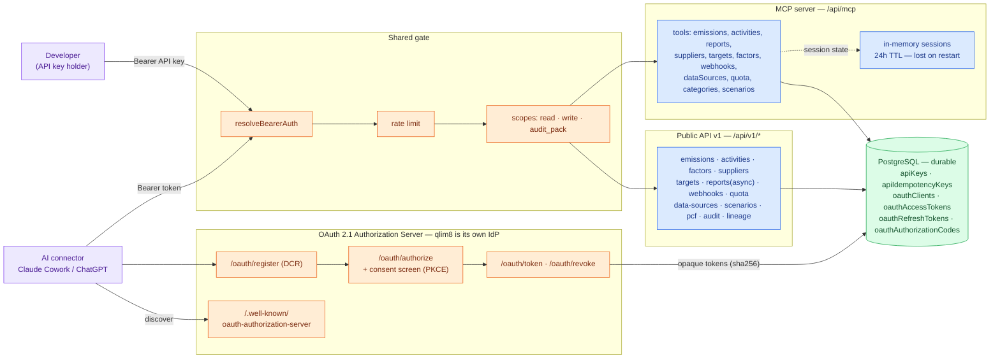

_Exports: [SVG](../../diagrams/svg/03-api-agent-surface.svg) · [PNG](../../diagrams/png/03-api-agent-surface.png) · [Mermaid](../../diagrams/mmd/03-api-agent-surface.mmd) · [Excalidraw](../../diagrams/excalidraw/03-api-agent-surface.excalidraw)_

**OAuth tokens are durable** (opaque sha256 hashes in Postgres); **MCP sessions are ephemeral**
(in-memory, 24h, re-initialised after a restart). Don't conflate them.

---

## 4. Domain data model

The schema is ~80 tables. Diagram 4a groups them into bounded contexts (every business row is
scoped to `tenants`); 4b and 4c show the two highest-value domains in detail.

### 4a. Bounded contexts

```mermaid
flowchart TB
  tenants[("tenants<br/>root — every row scoped here")]

  subgraph auth["Auth & multi-tenancy"]
    a1["users · departments · sessions<br/>loginHistory · mfaTrustedDevices<br/>mfaRecoveryCodes · passwordResetTokens<br/>emailVerificationCodes · tenantTeamInvitations"]
  end
  subgraph carbon["Carbon accounting core"]
    c1["activities · activitySplits · emissionEntries<br/>emissionEntryCategoryChanges · dataSources<br/>emissionFactors · countryEmissionFactors<br/>emissionCategories · unitConversions<br/>priceIndices · currencyRates · categoryCorrections"]
  end
  subgraph reduce["Reduction & scenarios"]
    r1["reductionGoals · reductionTargets<br/>scenarios · tiltag · activityOntology<br/>auditLog · dismissedRecommendations"]
  end
  subgraph rep["Reporting & compliance"]
    rp1["generatedReports · apiReportJobs<br/>reportAttestations"]
  end
  subgraph tp["Third-party consultant"]
    t1["thirdPartyAccessGrants<br/>ledgerCommentThreads · ledgerComments<br/>ledgerCommentReads"]
  end
  subgraph scope3["Supplier / Scope 3"]
    sc1["supplierConnections"]
  end
  subgraph bill["Billing & quota"]
    b1["invoiceBatches · invoiceQueueItems<br/>quota periods · quota purchases"]
  end
  subgraph pcf["PCF / EPD"]
    p1["pcfDocuments · pcfExtractionDrafts<br/>pcfRecords"]
  end
  subgraph notif["Notifications & audit"]
    n1["notifications · auditEvents · announcements<br/>userAnnouncementSeen · userVersionSeen"]
  end
  subgraph api["Public API & OAuth"]
    ap1["apiKeys · apiIdempotencyKeys<br/>webhooks · webhookDeliveries<br/>oauthClients · oauthAccessTokens<br/>oauthRefreshTokens · oauthAuthorizationCodes"]
  end

  tenants --- auth
  tenants --- carbon
  tenants --- reduce
  tenants --- rep
  tenants --- tp
  tenants --- scope3
  tenants --- bill
  tenants --- pcf
  tenants --- notif
  tenants --- api

  classDef store fill:#dcfce7,stroke:#16a34a,color:#14532d;
  classDef internal fill:#dbeafe,stroke:#2563eb,color:#1e3a8a;
  class tenants store;
  class a1,c1,r1,rp1,t1,sc1,b1,p1,n1,ap1 internal;
```

_Exports: [SVG](../../diagrams/svg/04a-data-model-domains.svg) · [PNG](../../diagrams/png/04a-data-model-domains.png) · [Mermaid](../../diagrams/mmd/04a-data-model-domains.mmd) · [Excalidraw](../../diagrams/excalidraw/04a-data-model-domains.excalidraw)_

For the full table list see [`../reference/database-schema.md`](https://github.com/madsdlund-nielsen/qlim8-app/blob/main/docs/en/reference/database-schema.md).

### 4b. Carbon accounting core (detailed)

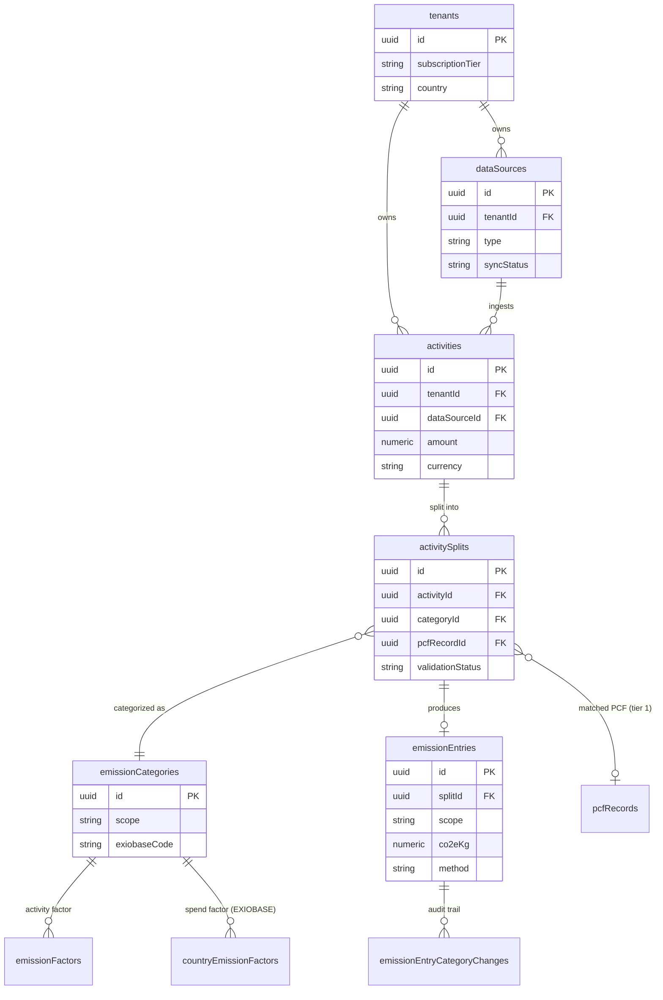

_Exports: [SVG](../../diagrams/svg/04b-data-model-carbon-core.svg) · [PNG](../../diagrams/png/04b-data-model-carbon-core.png) · [Mermaid](../../diagrams/mmd/04b-data-model-carbon-core.mmd) · [Excalidraw](../../diagrams/excalidraw/04b-data-model-carbon-core.excalidraw)_

### 4c. Public API & OAuth storage (detailed)

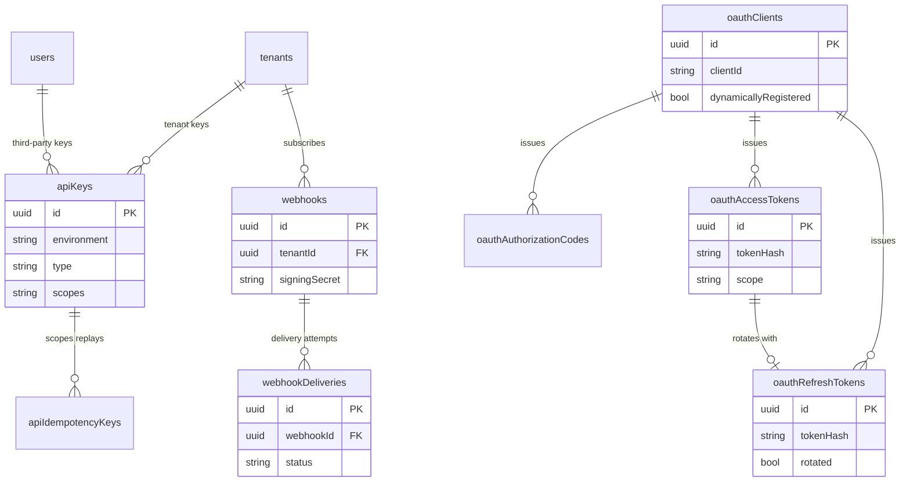

_Exports: [SVG](../../diagrams/svg/04c-data-model-public-api.svg) · [PNG](../../diagrams/png/04c-data-model-public-api.png) · [Mermaid](../../diagrams/mmd/04c-data-model-public-api.mmd) · [Excalidraw](../../diagrams/excalidraw/04c-data-model-public-api.excalidraw)_

---

## 5. Landing architecture & app bridges

How the marketing site is built and exactly where it hands off to the app.

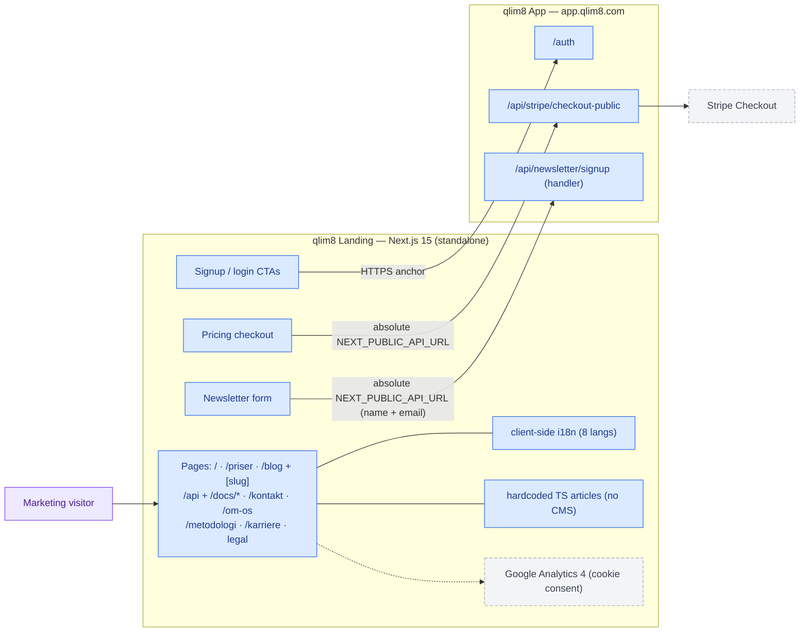

_Exports: [SVG](../../diagrams/svg/06-landing-bridges.svg) · [PNG](../../diagrams/png/06-landing-bridges.png) · [Mermaid](../../diagrams/mmd/06-landing-bridges.mmd) · [Excalidraw](../../diagrams/excalidraw/06-landing-bridges.excalidraw)_

> ✅ **Fixed.** `NewsletterForm.tsx` and `NewsletterSignupDialog.tsx` now POST to the
> **absolute** app URL (`NEXT_PUBLIC_API_URL ?? https://app.qlim8.com`) — the same pattern as the
> pricing checkout — so the request reaches the app's `/api/newsletter/signup` handler (CORS
> already allows the `qlim8.com` origin). The email-only dialog now also sends the required `name`.
> Previously it POSTed to a relative path that dead-ended at the Next server. See note 1 in §8.

The `legacy/` directory in the landing repo is a pre-rewrite backup and is intentionally omitted.

---

## 6. Deployment & CI/CD topology

Two **independent** deployments on Hetzner (Germany), each with its own nginx, certbot, and
release pipeline. They share no database and no internal network — only public HTTPS + Stripe.

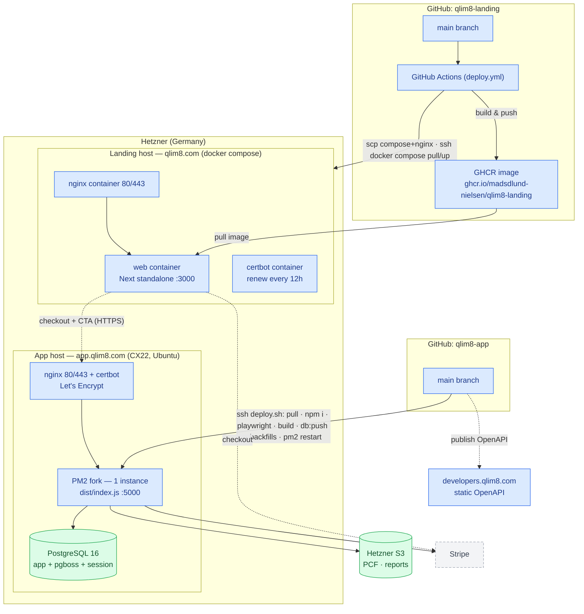

_Exports: [SVG](../../diagrams/svg/05-deployment.svg) · [PNG](../../diagrams/png/05-deployment.png) · [Mermaid](../../diagrams/mmd/05-deployment.mmd) · [Excalidraw](../../diagrams/excalidraw/05-deployment.excalidraw)_

- **App** ships via `deploy.sh` over SSH (`git pull → npm install → playwright install →
  npm run build → npm run db:push --force → backfills → pm2 restart`), then publishes the
  OpenAPI snapshot to the static developer portal.
- **Landing** ships via GitHub Actions: build a multi-stage Alpine/Node 22 standalone image →
  push to GHCR → SCP `docker-compose.yml`+`nginx.conf` → SSH `docker compose pull web && up -d`.

---

## 7. Key flows

### 7.1 Invoice ingest → AI → 3-tier calc → emission entry

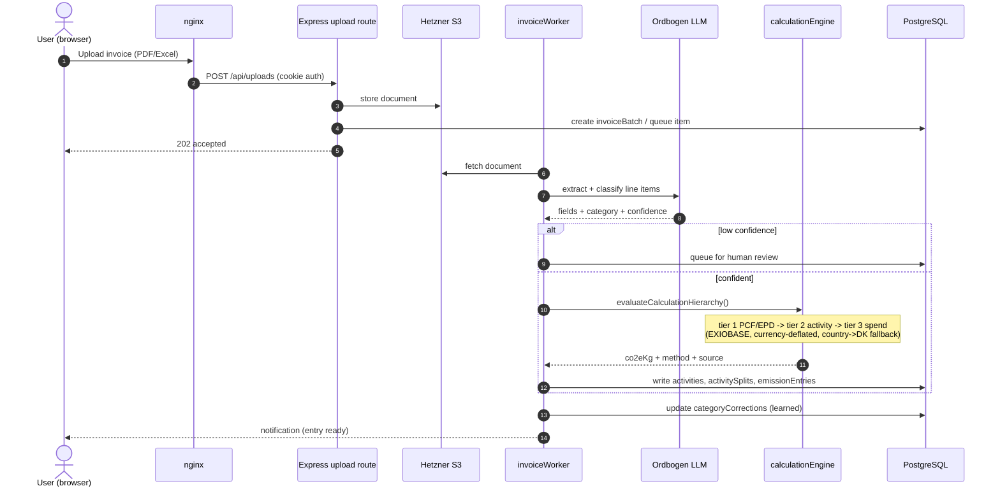

_Exports: [SVG](../../diagrams/svg/07-seq-invoice.svg) · [PNG](../../diagrams/png/07-seq-invoice.png) · [Mermaid](../../diagrams/mmd/07-seq-invoice.mmd) · [Excalidraw](../../diagrams/excalidraw/07-seq-invoice.excalidraw)_

### 7.2 Pricing checkout bridge (landing → app → Stripe)

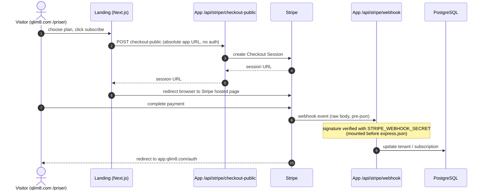

_Exports: [SVG](../../diagrams/svg/08-seq-checkout.svg) · [PNG](../../diagrams/png/08-seq-checkout.png) · [Mermaid](../../diagrams/mmd/08-seq-checkout.mmd) · [Excalidraw](../../diagrams/excalidraw/08-seq-checkout.excalidraw)_

### 7.3 OAuth 2.1 / MCP connector auth

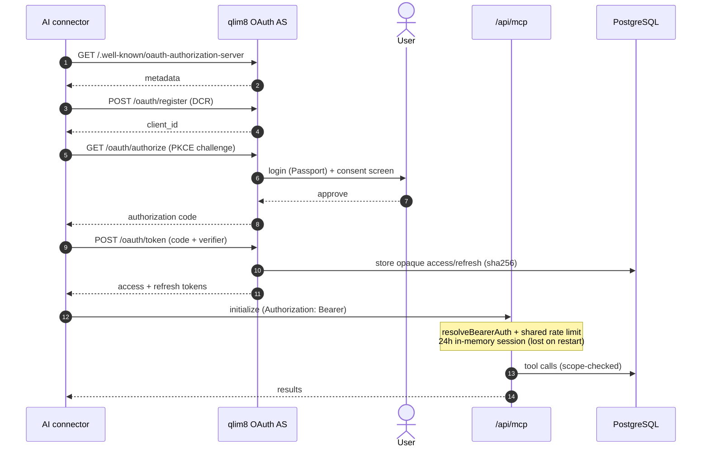

_Exports: [SVG](../../diagrams/svg/09-seq-oauth-mcp.svg) · [PNG](../../diagrams/png/09-seq-oauth-mcp.png) · [Mermaid](../../diagrams/mmd/09-seq-oauth-mcp.mmd) · [Excalidraw](../../diagrams/excalidraw/09-seq-oauth-mcp.excalidraw)_

### 7.4 Async v1 report job (pg-boss)

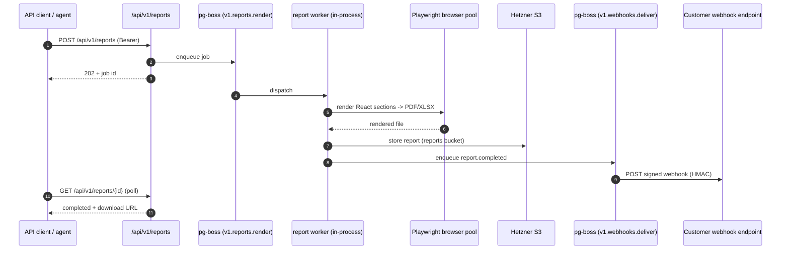

_Exports: [SVG](../../diagrams/svg/10-seq-report-job.svg) · [PNG](../../diagrams/png/10-seq-report-job.png) · [Mermaid](../../diagrams/mmd/10-seq-report-job.mmd) · [Excalidraw](../../diagrams/excalidraw/10-seq-report-job.excalidraw)_

---

## 8. Architectural notes & known gaps

1. **Newsletter bridge — fixed.** The landing forms now POST to the **absolute** app URL
   (`NEXT_PUBLIC_API_URL ?? https://app.qlim8.com`) and reach the app's `/api/newsletter/signup`
   handler; the email-only dialog now also sends the required `name`. (Previously a relative
   `/api/newsletter/signup` dead-ended at the Next server — no handler, no `/api` proxy.)
2. **One process.** SPA static serving, all four API surfaces, every worker, and the Playwright
   pool live in a single PM2 fork instance. There is no separate worker/render service.
3. **pg-boss is not separate infra.** It runs in the app's PostgreSQL under the `pgboss` schema.
4. **qlim8 is its own OAuth IdP** (consent screen + dynamic client registration + PKCE). No
   Auth0/Google; all tokens and consent live in EU Postgres (GDPR).
5. **First-party PostHog proxy** via app nginx `/ingest/` (events) + `/ingest/static/` (assets).
6. **Stripe webhook bypasses the JSON body parser** (raw body, registered first).
7. **Two deployments, bridged only by public HTTPS + Stripe.** No shared DB or internal network.
   Two nginx instances and two certbots (bare-metal vs dockerized). Landing analytics is GA4;
   app analytics is PostHog.
8. **Multi-tenancy + consultant context.** Tenant isolation via `resolveTenantContext`;
   consultants switch client with the `X-Client-Tenant-Id` header; a `thirdPartyMutationGuard`
   denies writes for `third_party` users except an allow-list.
9. **MCP sessions are ephemeral** (in-memory, 24h, lost on restart) while OAuth/API tokens are
   durable in Postgres.
10. **Report generation is dual-path:** legacy jspdf generators (standard/CSRD/VSME) and the
    newer Playwright + React section renderer (via the browser pool).
11. **3-tier calculation fallback:** PCF/EPD (supplier-specific) → activity factor → spend-based
    EXIOBASE, with country→DK factor fallback and currency deflation (HICP/CPI).

## Related documents

- [`architecture/overview.md`](https://github.com/madsdlund-nielsen/qlim8-app/blob/main/docs/en/architecture/overview.md)
- [`architecture/data-flow.md`](https://github.com/madsdlund-nielsen/qlim8-app/blob/main/docs/en/architecture/data-flow.md)
- [`architecture/deployment.md`](https://github.com/madsdlund-nielsen/qlim8-app/blob/main/docs/en/architecture/deployment.md)
- [`architecture/auth-and-tenancy.md`](https://github.com/madsdlund-nielsen/qlim8-app/blob/main/docs/en/architecture/auth-and-tenancy.md)
- [`architecture/security-and-gdpr.md`](https://github.com/madsdlund-nielsen/qlim8-app/blob/main/docs/en/architecture/security-and-gdpr.md)
- [`reference/database-schema.md`](https://github.com/madsdlund-nielsen/qlim8-app/blob/main/docs/en/reference/database-schema.md)
- [Diagram sources & exports](../../diagrams/README.md)
