# System architecture: qlim8 app + landing, end to end

> Status: stable · Last updated: 2026-09-25 · Owner: qlim8 team

> ℹ️ **Synced copy.** This architecture reference is maintained in the **qlim8-app** repository
> ([`docs/en/architecture/system-architecture.md`](https://github.com/madsdlund-nielsen/qlim8-app/blob/main/docs/en/architecture/system-architecture.md)),
> which is the system of record. It is copied here so the landing repo also documents the whole
> system. Last synced: 2026-06-29. Updated here on 2026-09-25, ahead of the qlim8-app copy, for
> the sales-led change (no signup, no checkout): §1, §5, §6, §7.2 and §8.

## Overview

This document is the **visual reference** for the whole qlim8 product: the carbon-accounting
SaaS application (`qlim8-app`, **app.qlim8.com**) and the marketing site (`qlim8-landing`,
**qlim8.com**). It complements the prose in [`overview.md`](https://github.com/madsdlund-nielsen/qlim8-app/blob/main/docs/en/architecture/overview.md),
[`data-flow.md`](https://github.com/madsdlund-nielsen/qlim8-app/blob/main/docs/en/architecture/data-flow.md) and [`deployment.md`](https://github.com/madsdlund-nielsen/qlim8-app/blob/main/docs/en/architecture/deployment.md) with a layered set of
diagrams, from a one-glance landscape down to individual request flows.

Diagrams are written in [Mermaid](https://mermaid.js.org) and render inline on GitHub. Every
diagram is also exported to **SVG, PNG and Excalidraw** under
[`../../diagrams/`](../../diagrams/README.md); the `.mmd` files there are the editable source of
truth. See that folder's README to regenerate the exports.

> **Convention:** diagram **labels are English/technical** (route names, service names) and a
> single shared image set is referenced by both this file and its Danish twin
> [`../../da/architecture/system-architecture.md`](../../da/architecture/system-architecture.md);
> only the surrounding prose is translated.

## How to read this document

Work top to bottom: each section zooms in:

1. **System context**: who uses what, and every external dependency.
2. **App runtime**: the request lifecycle inside the single server process.
3. **Public API & agent surface**: the v1 / MCP / OAuth triad (a product differentiator).
4. **Domain data model**: the ~80-table schema, grouped by bounded context.
5. **Landing & app bridges**: how the marketing site hands off to the app.
6. **Deployment & CI/CD**: where it all runs.
7. **Key flows**: sequence diagrams for the load-bearing scenarios.
8. **Architectural notes & known gaps**: the things a diagram alone could mislead you on.

### Legend

| Style | Meaning |
|---|---|
| 🟦 Blue | Internal qlim8 component |
| 🟪 Purple | Human persona / actor |
| ⬜ Grey, dashed border | External SaaS / third-party |
| 🟩 Green cylinder | Data store |
| 🟧 Orange | Security / auth boundary |
| 🟥 Red, dashed | Known gap / caveated edge |
| Dashed edge | Asynchronous / proxied / out-of-band |

---

## 1. System context

The landscape: both products, all human personas, AI-agent connectors, and every external
service. This single diagram also serves as the high-level overview.

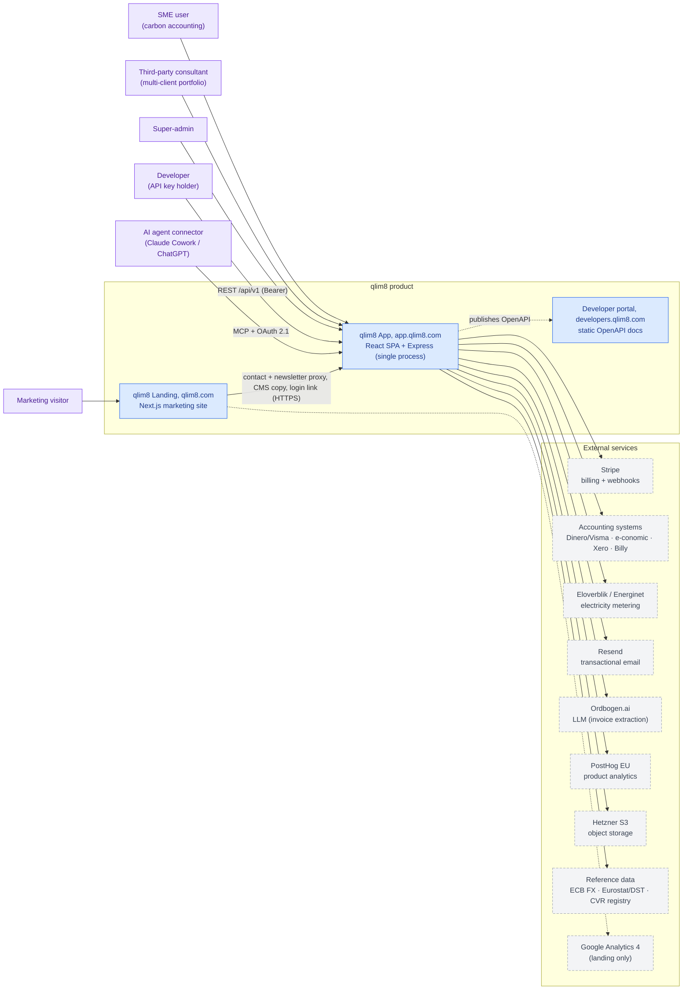
```mermaid
flowchart LR
  user["SME user<br/>(carbon accounting)"]
  consult["Third-party consultant<br/>(multi-client portfolio)"]
  admin["Super-admin"]
  dev["Developer<br/>(API key holder)"]
  agent["AI agent connector<br/>(Claude Cowork / ChatGPT)"]
  visitor["Marketing visitor"]

  subgraph qlim8["qlim8 product"]
    app["qlim8 App, app.qlim8.com<br/>React SPA + Express (single process)"]
    landing["qlim8 Landing, qlim8.com<br/>Next.js marketing site"]
    devportal["Developer portal, developers.qlim8.com<br/>static OpenAPI docs"]
  end

  subgraph ext["External services"]
    stripe["Stripe<br/>billing + webhooks"]
    acct["Accounting systems<br/>Dinero/Visma · e-conomic · Xero · Billy"]
    elo["Eloverblik / Energinet<br/>electricity metering"]
    resend["Resend<br/>transactional email"]
    ord["Ordbogen.ai<br/>LLM (invoice extraction)"]
    posthog["PostHog EU<br/>product analytics"]
    s3["Hetzner S3<br/>object storage"]
    refdata["Reference data<br/>ECB FX · Eurostat/DST · CVR registry"]
    ga["Google Analytics 4<br/>(landing only)"]
  end

  visitor --> landing
  user --> app
  consult --> app
  admin --> app
  dev -->|"REST /api/v1 (Bearer)"| app
  agent -->|"MCP + OAuth 2.1"| app

  landing -->|"contact + newsletter proxy, CMS copy, login link (HTTPS)"| app
  landing -.-> ga

  app --> stripe
  app --> acct
  app --> elo
  app --> resend
  app --> ord
  app --> posthog
  app --> s3
  app --> refdata
  app -. publishes OpenAPI .-> devportal

  classDef persona fill:#ede9fe,stroke:#7c3aed,color:#4c1d95;
  classDef internal fill:#dbeafe,stroke:#2563eb,color:#1e3a8a;
  classDef external fill:#f3f4f6,stroke:#9ca3af,color:#374151,stroke-dasharray:5 3;
  class user,consult,admin,dev,agent,visitor persona;
  class app,landing,devportal internal;
  class stripe,acct,elo,resend,ord,posthog,s3,refdata,ga external;
```

_Exports: [SVG](../../diagrams/svg/01-system-context.svg) · [PNG](../../diagrams/png/01-system-context.png) · [Mermaid](../../diagrams/mmd/01-system-context.mmd) · [Excalidraw](../../diagrams/excalidraw/01-system-context.excalidraw)_

The two products are **separate deployments** that bridge only over public HTTPS: the landing
server's contact and newsletter proxies, its CMS reads, and the login link for existing customers.
There is no signup or checkout bridge, because qlim8 is sold after a demo (§5, §7.2). All product
data lives in the EU (Hetzner Germany).

---

## 2. App runtime / container architecture

The request lifecycle inside the app. The most important thing this diagram says: **the SPA,
all four API surfaces, and every background worker run in a single PM2 fork process** on port
5000: there is no separate worker tier.

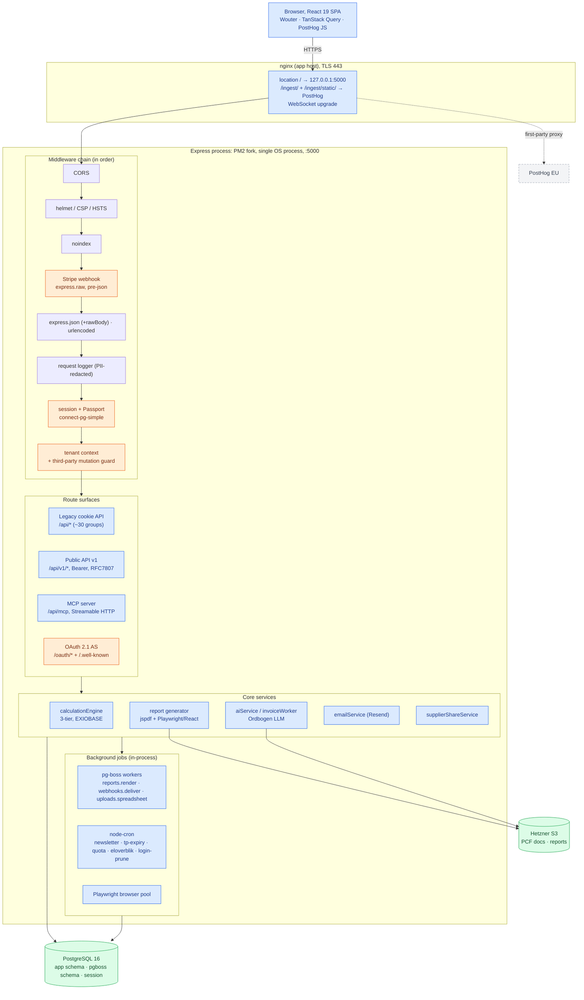
```mermaid
flowchart TB
  browser["Browser, React 19 SPA<br/>Wouter · TanStack Query · PostHog JS"]
  posthog["PostHog EU"]

  subgraph nginxbox["nginx (app host), TLS 443"]
    nginx["location / &rarr; 127.0.0.1:5000<br/>/ingest/ + /ingest/static/ &rarr; PostHog<br/>WebSocket upgrade"]
  end

  subgraph proc["Express process: PM2 fork, single OS process, :5000"]
    direction TB
    subgraph mw["Middleware chain (in order)"]
      direction TB
      cors["CORS"] --> helmet["helmet / CSP / HSTS"] --> noindex["noindex"]
      noindex --> stripehook["Stripe webhook<br/>express.raw, pre-json"]
      stripehook --> json["express.json (+rawBody) · urlencoded"]
      json --> logger["request logger (PII-redacted)"]
      logger --> sess["session + Passport<br/>connect-pg-simple"]
      sess --> tenant["tenant context<br/>+ third-party mutation guard"]
    end

    subgraph surfaces["Route surfaces"]
      legacy["Legacy cookie API<br/>/api/* (~30 groups)"]
      v1["Public API v1<br/>/api/v1/*, Bearer, RFC7807"]
      mcp["MCP server<br/>/api/mcp, Streamable HTTP"]
      oauth["OAuth 2.1 AS<br/>/oauth/* + /.well-known"]
    end

    subgraph svc["Core services"]
      calc["calculationEngine<br/>3-tier, EXIOBASE"]
      ai["aiService / invoiceWorker<br/>Ordbogen LLM"]
      report["report generator<br/>jspdf + Playwright/React"]
      email["emailService (Resend)"]
      supplier["supplierShareService"]
    end

    subgraph jobs["Background jobs (in-process)"]
      pgboss["pg-boss workers<br/>reports.render · webhooks.deliver · uploads.spreadsheet"]
      cron["node-cron<br/>newsletter · tp-expiry · quota · eloverblik · login-prune"]
      pool["Playwright browser pool"]
    end
  end

  pg[("PostgreSQL 16<br/>app schema · pgboss schema · session")]
  s3[("Hetzner S3<br/>PCF docs · reports")]

  browser -->|HTTPS| nginx
  nginx --> cors
  tenant --> surfaces
  surfaces --> svc
  svc --> jobs
  svc --> pg
  jobs --> pg
  report --> s3
  ai --> s3
  nginx -. first-party proxy .-> posthog

  classDef internal fill:#dbeafe,stroke:#2563eb,color:#1e3a8a;
  classDef store fill:#dcfce7,stroke:#16a34a,color:#14532d;
  classDef security fill:#ffedd5,stroke:#ea580c,color:#7c2d12;
  classDef external fill:#f3f4f6,stroke:#9ca3af,color:#374151,stroke-dasharray:5 3;
  class browser,nginx,legacy,v1,mcp,calc,ai,report,email,supplier,pgboss,cron,pool internal;
  class oauth,stripehook,sess,tenant security;
  class pg,s3 store;
  class posthog external;
```

_Exports: [SVG](../../diagrams/svg/02-app-runtime.svg) · [PNG](../../diagrams/png/02-app-runtime.png) · [Mermaid](../../diagrams/mmd/02-app-runtime.mmd) · [Excalidraw](../../diagrams/excalidraw/02-app-runtime.excalidraw)_

Notes:
- The **Stripe webhook is mounted before `express.json()`** so the raw body is available for
  signature verification, it sits outside the normal JSON path (see `server/index.ts`).
- **nginx proxies PostHog first-party** via `/ingest/` (events) and `/ingest/static/` (SDK
  assets); the browser never talks to PostHog directly, which keeps analytics ad-blocker-resistant.
- Background workers are started in the `httpServer.listen` callback: same process, same memory.

---

## 3. Public API & AI-agent surface

A zoom on the **v1 + MCP + OAuth** triad. qlim8 is its **own OAuth 2.1 Identity Provider**, 
there is no external IdP, which lets AI connectors (Claude Cowork, ChatGPT) authenticate and
drive the MCP tools. v1 and MCP share the same bearer-auth and rate-limiting code.

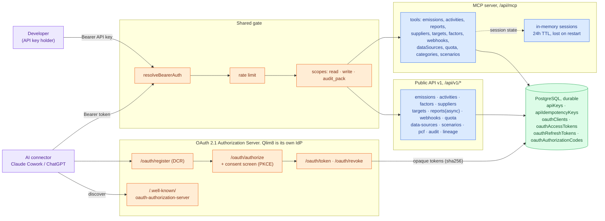
```mermaid
flowchart LR
  dev["Developer<br/>(API key holder)"]
  connector["AI connector<br/>Claude Cowork / ChatGPT"]

  subgraph as["OAuth 2.1 Authorization Server. Qlim8 is its own IdP"]
    disc["/.well-known/<br/>oauth-authorization-server"]
    reg["/oauth/register (DCR)"]
    authz["/oauth/authorize<br/>+ consent screen (PKCE)"]
    token["/oauth/token · /oauth/revoke"]
  end

  subgraph shared["Shared gate"]
    bearer["resolveBearerAuth"]
    rl["rate limit"]
    scopes["scopes: read · write · audit_pack"]
  end

  subgraph v1["Public API v1, /api/v1/*"]
    v1r["emissions · activities · factors · suppliers<br/>targets · reports(async) · webhooks · quota<br/>data-sources · scenarios · pcf · audit · lineage"]
  end

  subgraph mcp["MCP server, /api/mcp"]
    mcptools["tools: emissions, activities, reports,<br/>suppliers, targets, factors, webhooks,<br/>dataSources, quota, categories, scenarios"]
    mcpsess["in-memory sessions<br/>24h TTL, lost on restart"]
  end

  pg[("PostgreSQL, durable<br/>apiKeys · apiIdempotencyKeys<br/>oauthClients · oauthAccessTokens<br/>oauthRefreshTokens · oauthAuthorizationCodes")]

  dev -->|"Bearer API key"| bearer
  connector -->|discover| disc
  connector --> reg --> authz --> token
  token -->|"opaque tokens (sha256)"| pg
  connector -->|"Bearer token"| bearer
  bearer --> rl --> scopes
  scopes --> v1r
  scopes --> mcptools
  v1r --> pg
  mcptools --> pg
  mcptools -. session state .-> mcpsess

  classDef internal fill:#dbeafe,stroke:#2563eb,color:#1e3a8a;
  classDef store fill:#dcfce7,stroke:#16a34a,color:#14532d;
  classDef security fill:#ffedd5,stroke:#ea580c,color:#7c2d12;
  classDef persona fill:#ede9fe,stroke:#7c3aed,color:#4c1d95;
  class dev,connector persona;
  class disc,reg,authz,token,bearer,rl,scopes security;
  class v1r,mcptools,mcpsess internal;
  class pg store;
```

_Exports: [SVG](../../diagrams/svg/03-api-agent-surface.svg) · [PNG](../../diagrams/png/03-api-agent-surface.png) · [Mermaid](../../diagrams/mmd/03-api-agent-surface.mmd) · [Excalidraw](../../diagrams/excalidraw/03-api-agent-surface.excalidraw)_

**OAuth tokens are durable** (opaque sha256 hashes in Postgres); **MCP sessions are ephemeral**
(in-memory, 24h, re-initialised after a restart). Don't conflate them.

---

## 4. Domain data model

The schema is ~80 tables. Diagram 4a groups them into bounded contexts (every business row is
scoped to `tenants`); 4b and 4c show the two highest-value domains in detail.

### 4a. Bounded contexts

```mermaid
flowchart TB
  tenants[("tenants<br/>root, every row scoped here")]

  subgraph auth["Auth & multi-tenancy"]
    a1["users · departments · sessions<br/>loginHistory · mfaTrustedDevices<br/>mfaRecoveryCodes · passwordResetTokens<br/>emailVerificationCodes · tenantTeamInvitations"]
  end
  subgraph carbon["Carbon accounting core"]
    c1["activities · activitySplits · emissionEntries<br/>emissionEntryCategoryChanges · dataSources<br/>emissionFactors · countryEmissionFactors<br/>emissionCategories · unitConversions<br/>priceIndices · currencyRates · categoryCorrections"]
  end
  subgraph reduce["Reduction & scenarios"]
    r1["reductionGoals · reductionTargets<br/>scenarios · tiltag · activityOntology<br/>auditLog · dismissedRecommendations"]
  end
  subgraph rep["Reporting & compliance"]
    rp1["generatedReports · apiReportJobs<br/>reportAttestations"]
  end
  subgraph tp["Third-party consultant"]
    t1["thirdPartyAccessGrants<br/>ledgerCommentThreads · ledgerComments<br/>ledgerCommentReads"]
  end
  subgraph scope3["Supplier / Scope 3"]
    sc1["supplierConnections"]
  end
  subgraph bill["Billing & quota"]
    b1["invoiceBatches · invoiceQueueItems<br/>quota periods · quota purchases"]
  end
  subgraph pcf["PCF / EPD"]
    p1["pcfDocuments · pcfExtractionDrafts<br/>pcfRecords"]
  end
  subgraph notif["Notifications & audit"]
    n1["notifications · auditEvents · announcements<br/>userAnnouncementSeen · userVersionSeen"]
  end
  subgraph api["Public API & OAuth"]
    ap1["apiKeys · apiIdempotencyKeys<br/>webhooks · webhookDeliveries<br/>oauthClients · oauthAccessTokens<br/>oauthRefreshTokens · oauthAuthorizationCodes"]
  end

  tenants --- auth
  tenants --- carbon
  tenants --- reduce
  tenants --- rep
  tenants --- tp
  tenants --- scope3
  tenants --- bill
  tenants --- pcf
  tenants --- notif
  tenants --- api

  classDef store fill:#dcfce7,stroke:#16a34a,color:#14532d;
  classDef internal fill:#dbeafe,stroke:#2563eb,color:#1e3a8a;
  class tenants store;
  class a1,c1,r1,rp1,t1,sc1,b1,p1,n1,ap1 internal;
```

_Exports: [SVG](../../diagrams/svg/04a-data-model-domains.svg) · [PNG](../../diagrams/png/04a-data-model-domains.png) · [Mermaid](../../diagrams/mmd/04a-data-model-domains.mmd) · [Excalidraw](../../diagrams/excalidraw/04a-data-model-domains.excalidraw)_

For the full table list see [`../reference/database-schema.md`](https://github.com/madsdlund-nielsen/qlim8-app/blob/main/docs/en/reference/database-schema.md).

### 4b. Carbon accounting core (detailed)

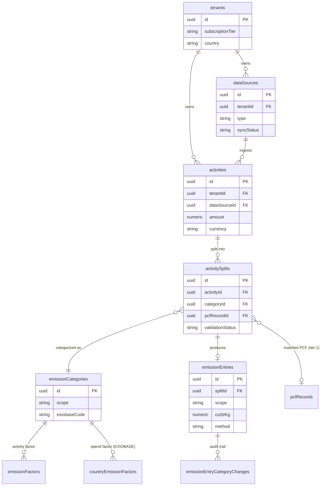
```mermaid
erDiagram
  tenants ||--o{ dataSources : "owns"
  tenants ||--o{ activities : "owns"
  dataSources ||--o{ activities : "ingests"
  activities ||--o{ activitySplits : "split into"
  activitySplits }o--|| emissionCategories : "categorized as"
  activitySplits ||--o| emissionEntries : "produces"
  emissionCategories ||--o{ emissionFactors : "activity factor"
  emissionCategories ||--o{ countryEmissionFactors : "spend factor (EXIOBASE)"
  activitySplits }o--o| pcfRecords : "matched PCF (tier 1)"
  emissionEntries ||--o{ emissionEntryCategoryChanges : "audit trail"

  tenants {
    uuid id PK
    string subscriptionTier
    string country
  }
  dataSources {
    uuid id PK
    uuid tenantId FK
    string type
    string syncStatus
  }
  activities {
    uuid id PK
    uuid tenantId FK
    uuid dataSourceId FK
    numeric amount
    string currency
  }
  activitySplits {
    uuid id PK
    uuid activityId FK
    uuid categoryId FK
    uuid pcfRecordId FK
    string validationStatus
  }
  emissionEntries {
    uuid id PK
    uuid splitId FK
    string scope
    numeric co2eKg
    string method
  }
  emissionCategories {
    uuid id PK
    string scope
    string exiobaseCode
  }
```

_Exports: [SVG](../../diagrams/svg/04b-data-model-carbon-core.svg) · [PNG](../../diagrams/png/04b-data-model-carbon-core.png) · [Mermaid](../../diagrams/mmd/04b-data-model-carbon-core.mmd) · [Excalidraw](../../diagrams/excalidraw/04b-data-model-carbon-core.excalidraw)_

### 4c. Public API & OAuth storage (detailed)

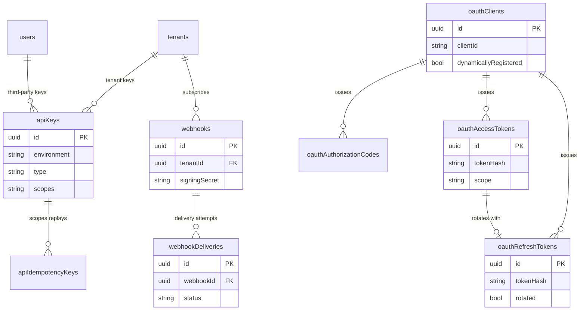
```mermaid
erDiagram
  tenants ||--o{ apiKeys : "tenant keys"
  users ||--o{ apiKeys : "third-party keys"
  tenants ||--o{ webhooks : "subscribes"
  webhooks ||--o{ webhookDeliveries : "delivery attempts"
  apiKeys ||--o{ apiIdempotencyKeys : "scopes replays"
  oauthClients ||--o{ oauthAuthorizationCodes : "issues"
  oauthClients ||--o{ oauthAccessTokens : "issues"
  oauthClients ||--o{ oauthRefreshTokens : "issues"
  oauthAccessTokens ||--o| oauthRefreshTokens : "rotates with"

  apiKeys {
    uuid id PK
    string environment
    string type
    string scopes
  }
  webhooks {
    uuid id PK
    uuid tenantId FK
    string signingSecret
  }
  webhookDeliveries {
    uuid id PK
    uuid webhookId FK
    string status
  }
  oauthClients {
    uuid id PK
    string clientId
    bool dynamicallyRegistered
  }
  oauthAccessTokens {
    uuid id PK
    string tokenHash
    string scope
  }
  oauthRefreshTokens {
    uuid id PK
    string tokenHash
    bool rotated
  }
```

_Exports: [SVG](../../diagrams/svg/04c-data-model-public-api.svg) · [PNG](../../diagrams/png/04c-data-model-public-api.png) · [Mermaid](../../diagrams/mmd/04c-data-model-public-api.mmd) · [Excalidraw](../../diagrams/excalidraw/04c-data-model-public-api.excalidraw)_

---

## 5. Landing architecture & app bridges

How the marketing site is built and exactly where it hands off to the app.

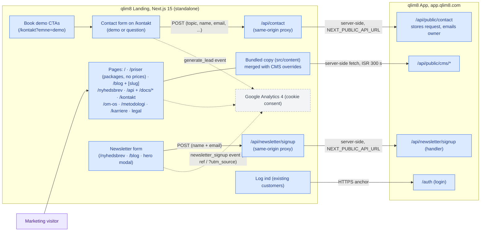
```mermaid
flowchart LR
  visitor["Marketing visitor"]

  subgraph landing["qlim8 Landing, Next.js 15 (standalone)"]
    pages["Pages: / · /priser (packages, no prices) · /blog + [slug]<br/>/nyhedsbrev · /api + /docs/* · /kontakt<br/>/om-os · /metodologi · /karriere · legal"]
    content["Bundled copy (src/content)<br/>merged with CMS overrides"]
    ga["Google Analytics 4 (cookie consent)"]
    cta["Book demo CTAs<br/>(/kontakt?emne=demo)"]
    contactform["Contact form on /kontakt<br/>(demo or question)"]
    contactproxy["/api/contact<br/>(same-origin proxy)"]
    nlform["Newsletter form<br/>(/nyhedsbrev · /blog · hero modal)"]
    nlproxy["/api/newsletter/signup<br/>(same-origin proxy)"]
    login["Log ind (existing customers)"]
  end

  subgraph app["qlim8 App, app.qlim8.com"]
    appauth["/auth (login)"]
    appcontact["/api/public/contact<br/>stores request, emails owner"]
    appnews["/api/newsletter/signup (handler)"]
    appcms["/api/public/cms/*"]
  end

  visitor --> pages
  pages --- content
  content -->|"server-side fetch, ISR 300 s"| appcms
  pages -.-> ga
  cta --> contactform
  contactform -->|"POST (topic, name, email, ...)"| contactproxy
  contactproxy -->|"server-side, NEXT_PUBLIC_API_URL"| appcontact
  contactform -.->|"generate_lead event"| ga
  nlform -->|"POST (name + email)"| nlproxy
  nlproxy -->|"server-side, NEXT_PUBLIC_API_URL"| appnews
  nlform -.->|"newsletter_signup event (?ref / ?utm_source)"| ga
  login -->|"HTTPS anchor"| appauth

  classDef internal fill:#dbeafe,stroke:#2563eb,color:#1e3a8a;
  classDef external fill:#f3f4f6,stroke:#9ca3af,color:#374151,stroke-dasharray:5 3;
  classDef persona fill:#ede9fe,stroke:#7c3aed,color:#4c1d95;
  class visitor persona;
  class pages,content,cta,contactform,contactproxy,nlform,nlproxy,login,appauth,appcontact,appnews,appcms internal;
  class ga external;
```

_Exports: [SVG](../../diagrams/svg/06-landing-bridges.svg) · [PNG](../../diagrams/png/06-landing-bridges.png) · [Mermaid](../../diagrams/mmd/06-landing-bridges.mmd) · [Excalidraw](../../diagrams/excalidraw/06-landing-bridges.excalidraw)_

**Sales-led: no signup, no checkout.** qlim8 is sold after a demo. The ways in are Book demo
(`/kontakt?emne=demo`), the contact form on `/kontakt`, the phone number and the newsletter, all
taken from `src/content/cta.ts`; `/priser` lists the packages without prices. The site no longer
calls the app's `/api/stripe/checkout-public` (the app has removed it too), and "Log ind" only
links existing customers to `app.qlim8.com/auth`. A new customer's account is created by a
super-admin after the demo, see §7.2.

**Both forms go through same-origin proxies.** `ContactForm.tsx` POSTs to `/api/contact`, and
`NewsletterForm.tsx` and `NewsletterSignupDialog.tsx` POST to `/api/newsletter/signup`. Those are
Next route handlers on the landing server (`app/api/contact/route.ts`,
`app/api/newsletter/signup/route.ts`) that forward server-side to
`NEXT_PUBLIC_API_URL ?? https://app.qlim8.com`, to `/api/public/contact` and
`/api/newsletter/signup` respectively. The browser never calls app.qlim8.com, so there is no CORS,
and the handler always answers JSON, even when the app host returns an nginx or rate-limit page.
Since every request reaches the app from the marketing host's IP, the app rate-limits contact
requests per submitted email rather than per IP. A sent contact form fires GA4 `generate_lead`
with its topic (`demo` or `question`); it has no Google Ads conversion yet.

Pages render the bundled copy in `src/content` merged with CMS overrides fetched from the app's
`/api/public/cms/*` (ISR, 300 s; the app's revalidate webhook clears the cache on publish). The
former client-side i18n layer is gone: the site is Danish only.

The `legacy/` directory in the landing repo is a pre-rewrite backup and is intentionally omitted.

---

## 6. Deployment & CI/CD topology

Two **independent** deployments on Hetzner (Germany), each with its own nginx, certbot, and
release pipeline. They share no database and no internal network, only public HTTPS. The landing
has no Stripe path of its own.

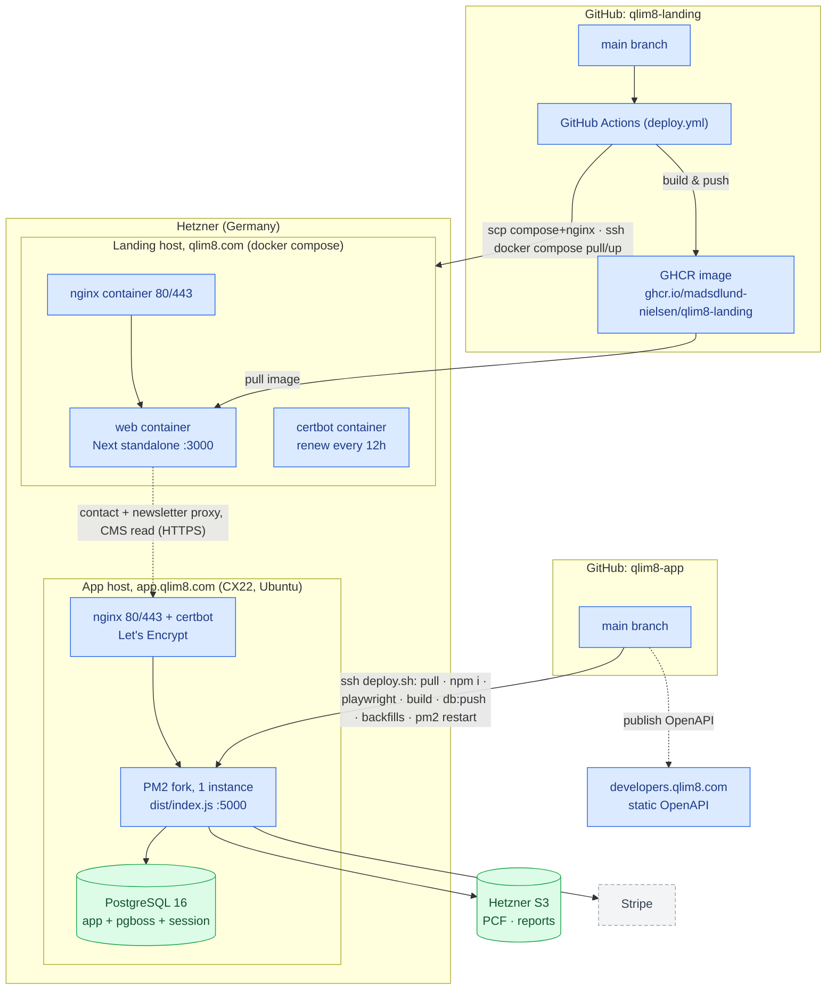
```mermaid
flowchart TB
  subgraph ghapp["GitHub: qlim8-app"]
    appmain["main branch"]
  end
  subgraph ghland["GitHub: qlim8-landing"]
    landmain["main branch"]
    gha["GitHub Actions (deploy.yml)"]
    ghcr["GHCR image<br/>ghcr.io/madsdlund-nielsen/qlim8-landing"]
  end

  subgraph hetzner["Hetzner (Germany)"]
    subgraph appvm["App host, app.qlim8.com (CX22, Ubuntu)"]
      anginx["nginx 80/443 + certbot<br/>Let's Encrypt"]
      pm2["PM2 fork, 1 instance<br/>dist/index.js :5000"]
      pg[("PostgreSQL 16<br/>app + pgboss + session")]
    end
    subgraph landvm["Landing host, qlim8.com (docker compose)"]
      lnginx["nginx container 80/443"]
      lweb["web container<br/>Next standalone :3000"]
      lcertbot["certbot container<br/>renew every 12h"]
    end
  end

  s3[("Hetzner S3<br/>PCF · reports")]
  stripe["Stripe"]
  devportal["developers.qlim8.com<br/>static OpenAPI"]

  appmain -->|"ssh deploy.sh: pull · npm i · playwright · build · db:push · backfills · pm2 restart"| pm2
  anginx --> pm2
  pm2 --> pg
  pm2 --> s3
  appmain -. publish OpenAPI .-> devportal

  landmain --> gha -->|build & push| ghcr
  gha -->|"scp compose+nginx · ssh docker compose pull/up"| landvm
  ghcr -->|pull image| lweb
  lnginx --> lweb

  lweb -. "contact + newsletter proxy, CMS read (HTTPS)" .-> anginx
  pm2 --> stripe

  classDef internal fill:#dbeafe,stroke:#2563eb,color:#1e3a8a;
  classDef store fill:#dcfce7,stroke:#16a34a,color:#14532d;
  classDef external fill:#f3f4f6,stroke:#9ca3af,color:#374151,stroke-dasharray:5 3;
  class appmain,landmain,gha,ghcr,anginx,pm2,lnginx,lweb,lcertbot,devportal internal;
  class pg,s3 store;
  class stripe external;
```

_Exports: [SVG](../../diagrams/svg/05-deployment.svg) · [PNG](../../diagrams/png/05-deployment.png) · [Mermaid](../../diagrams/mmd/05-deployment.mmd) · [Excalidraw](../../diagrams/excalidraw/05-deployment.excalidraw)_

- **App** ships via `deploy.sh` over SSH (`git pull → npm install → playwright install →
  npm run build → npm run db:push --force → backfills → pm2 restart`), then publishes the
  OpenAPI snapshot to the static developer portal.
- **Landing** ships via GitHub Actions: build a multi-stage Alpine/Node 22 standalone image →
  push to GHCR → SCP `docker-compose.yml`+`nginx.conf` → SSH `docker compose pull web && up -d`.

---

## 7. Key flows

### 7.1 Invoice ingest → AI → 3-tier calc → emission entry

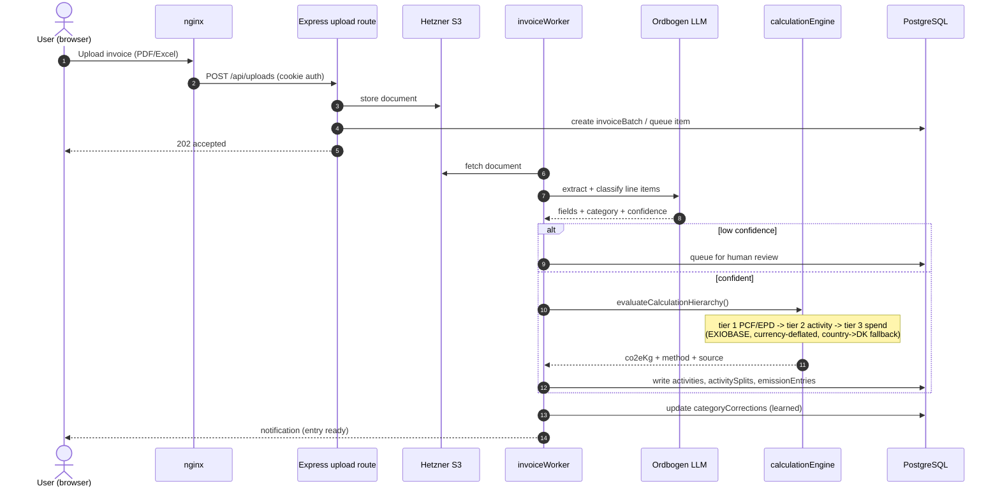
```mermaid
sequenceDiagram
  autonumber
  actor U as User (browser)
  participant N as nginx
  participant API as Express upload route
  participant S3 as Hetzner S3
  participant W as invoiceWorker
  participant LLM as Ordbogen LLM
  participant CALC as calculationEngine
  participant DB as PostgreSQL

  U->>N: Upload invoice (PDF/Excel)
  N->>API: POST /api/uploads (cookie auth)
  API->>S3: store document
  API->>DB: create invoiceBatch / queue item
  API-->>U: 202 accepted
  W->>S3: fetch document
  W->>LLM: extract + classify line items
  LLM-->>W: fields + category + confidence
  alt low confidence
    W->>DB: queue for human review
  else confident
    W->>CALC: evaluateCalculationHierarchy()
    Note over CALC: tier 1 PCF/EPD -> tier 2 activity -> tier 3 spend<br/>(EXIOBASE, currency-deflated, country->DK fallback)
    CALC-->>W: co2eKg + method + source
    W->>DB: write activities, activitySplits, emissionEntries
  end
  W->>DB: update categoryCorrections (learned)
  W-->>U: notification (entry ready)
```

_Exports: [SVG](../../diagrams/svg/07-seq-invoice.svg) · [PNG](../../diagrams/png/07-seq-invoice.png) · [Mermaid](../../diagrams/mmd/07-seq-invoice.mmd) · [Excalidraw](../../diagrams/excalidraw/07-seq-invoice.excalidraw)_

### 7.2 Demo request → customer account (landing → app → owner)

This replaces the former pricing checkout bridge (landing → app `/api/stripe/checkout-public` →
Stripe), which no longer exists on either side.

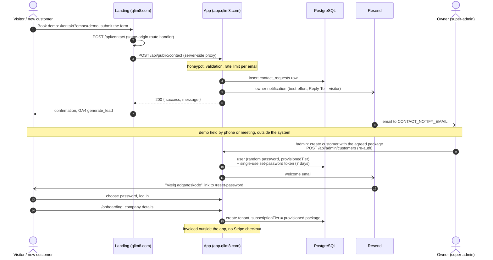
```mermaid
sequenceDiagram
  autonumber
  actor V as Visitor / new customer
  participant L as Landing (qlim8.com)
  participant A as App (app.qlim8.com)
  participant DB as PostgreSQL
  participant R as Resend
  actor O as Owner (super-admin)

  V->>L: Book demo: /kontakt?emne=demo, submit the form
  L->>L: POST /api/contact (same-origin route handler)
  L->>A: POST /api/public/contact (server-side proxy)
  Note over A: honeypot, validation, rate limit per email
  A->>DB: insert contact_requests row
  A-)R: owner notification (best-effort, Reply-To = visitor)
  A-->>L: 200 { success, message }
  L-->>V: confirmation, GA4 generate_lead
  R-)O: email to CONTACT_NOTIFY_EMAIL
  Note over V,O: demo held by phone or meeting, outside the system
  O->>A: /admin: create customer with the agreed package<br/>POST /api/admin/customers (re-auth)
  A->>DB: user (random password, provisionedTier)<br/>+ single-use set-password token (7 days)
  A-)R: welcome email
  R-)V: "Vælg adgangskode" link to /reset-password
  V->>A: choose password, log in
  V->>A: /onboarding: company details
  A->>DB: create tenant, subscriptionTier = provisioned package
  Note over A: invoiced outside the app, no Stripe checkout
```

_Exports: [SVG](../../diagrams/svg/08-seq-demo-request.svg) · [PNG](../../diagrams/png/08-seq-demo-request.png) · [Mermaid](../../diagrams/mmd/08-seq-demo-request.mmd) · [Excalidraw](../../diagrams/excalidraw/08-seq-demo-request.excalidraw)_

A visitor who calls instead skips steps 1 to 8; the account steps are the same. The contact
request is stored before the owner is emailed, and a failed email never fails the response; the
requests are also listed in the app under /admin → Users & Leads → Contact requests. Existing
Stripe subscriptions and add-on purchases still run through the app's Stripe integration and
webhook (§2), but nothing on qlim8.com starts a payment.

### 7.3 OAuth 2.1 / MCP connector auth

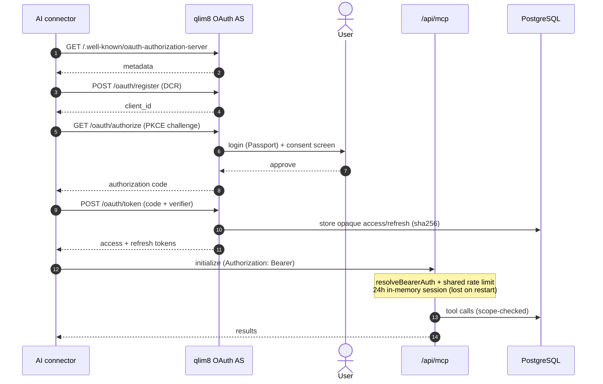
```mermaid
sequenceDiagram
  autonumber
  participant C as AI connector
  participant AS as qlim8 OAuth AS
  actor U as User
  participant MCP as /api/mcp
  participant DB as PostgreSQL

  C->>AS: GET /.well-known/oauth-authorization-server
  AS-->>C: metadata
  C->>AS: POST /oauth/register (DCR)
  AS-->>C: client_id
  C->>AS: GET /oauth/authorize (PKCE challenge)
  AS->>U: login (Passport) + consent screen
  U-->>AS: approve
  AS-->>C: authorization code
  C->>AS: POST /oauth/token (code + verifier)
  AS->>DB: store opaque access/refresh (sha256)
  AS-->>C: access + refresh tokens
  C->>MCP: initialize (Authorization: Bearer)
  Note over MCP: resolveBearerAuth + shared rate limit<br/>24h in-memory session (lost on restart)
  MCP->>DB: tool calls (scope-checked)
  MCP-->>C: results
```

_Exports: [SVG](../../diagrams/svg/09-seq-oauth-mcp.svg) · [PNG](../../diagrams/png/09-seq-oauth-mcp.png) · [Mermaid](../../diagrams/mmd/09-seq-oauth-mcp.mmd) · [Excalidraw](../../diagrams/excalidraw/09-seq-oauth-mcp.excalidraw)_

### 7.4 Async v1 report job (pg-boss)

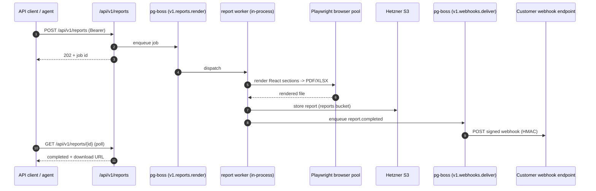
```mermaid
sequenceDiagram
  autonumber
  participant C as API client / agent
  participant API as /api/v1/reports
  participant Q as pg-boss (v1.reports.render)
  participant R as report worker (in-process)
  participant POOL as Playwright browser pool
  participant S3 as Hetzner S3
  participant WHQ as pg-boss (v1.webhooks.deliver)
  participant EP as Customer webhook endpoint

  C->>API: POST /api/v1/reports (Bearer)
  API->>Q: enqueue job
  API-->>C: 202 + job id
  Q->>R: dispatch
  R->>POOL: render React sections -> PDF/XLSX
  POOL-->>R: rendered file
  R->>S3: store report (reports bucket)
  R->>WHQ: enqueue report.completed
  WHQ->>EP: POST signed webhook (HMAC)
  C->>API: GET /api/v1/reports/{id} (poll)
  API-->>C: completed + download URL
```

_Exports: [SVG](../../diagrams/svg/10-seq-report-job.svg) · [PNG](../../diagrams/png/10-seq-report-job.png) · [Mermaid](../../diagrams/mmd/10-seq-report-job.mmd) · [Excalidraw](../../diagrams/excalidraw/10-seq-report-job.excalidraw)_

---

## 8. Architectural notes & known gaps

1. **Form bridges are same-origin proxies.** The contact form (`/api/contact` → app
   `/api/public/contact`) and the newsletter forms (`/api/newsletter/signup` → app
   `/api/newsletter/signup`) POST to route handlers on the landing server, which forward
   server-side to `NEXT_PUBLIC_API_URL ?? https://app.qlim8.com`. (The newsletter forms first
   POSTed to a relative path with no handler, which dead-ended at the Next server, and then to the
   absolute app URL.) Both newsletter surfaces collect a real name and email.
   Signup lives on the standalone `/nyhedsbrev` page, in an embedded block on `/blog` and
   article pages, and in the homepage hero dialog, the last of which also opens from
   `/?nyhedsbrev=1`, so a single link can point at signup without leaving the homepage.
   A successful signup fires a GA4 `newsletter_signup` event carrying a `signup_source`
   token resolved from `?ref` then `?utm_source` (`src/lib/tracking.ts`), which is how
   off-site placements are attributed. The POST body itself stays `{ name, email }`.
2. **One process.** SPA static serving, all four API surfaces, every worker, and the Playwright
   pool live in a single PM2 fork instance. There is no separate worker/render service.
3. **pg-boss is not separate infra.** It runs in the app's PostgreSQL under the `pgboss` schema.
4. **qlim8 is its own OAuth IdP** (consent screen + dynamic client registration + PKCE). No
   Auth0/Google; all tokens and consent live in EU Postgres (GDPR).
5. **First-party PostHog proxy** via app nginx `/ingest/` (events) + `/ingest/static/` (assets).
6. **Stripe webhook bypasses the JSON body parser** (raw body, registered first).
7. **Two deployments, bridged only by public HTTPS.** No shared DB or internal network.
   Two nginx instances and two certbots (bare-metal vs dockerized). Landing analytics is GA4;
   app analytics is PostHog.
8. **Multi-tenancy + consultant context.** Tenant isolation via `resolveTenantContext`;
   consultants switch client with the `X-Client-Tenant-Id` header; a `thirdPartyMutationGuard`
   denies writes for `third_party` users except an allow-list.
9. **MCP sessions are ephemeral** (in-memory, 24h, lost on restart) while OAuth/API tokens are
   durable in Postgres.
10. **Report generation is dual-path:** legacy jspdf generators (standard/CSRD/VSME) and the
    newer Playwright + React section renderer (via the browser pool).
11. **3-tier calculation fallback:** PCF/EPD (supplier-specific) → activity factor → spend-based
    EXIOBASE, with country→DK factor fallback and currency deflation (HICP/CPI).

## Related documents

- [`architecture/overview.md`](https://github.com/madsdlund-nielsen/qlim8-app/blob/main/docs/en/architecture/overview.md)
- [`architecture/data-flow.md`](https://github.com/madsdlund-nielsen/qlim8-app/blob/main/docs/en/architecture/data-flow.md)
- [`architecture/deployment.md`](https://github.com/madsdlund-nielsen/qlim8-app/blob/main/docs/en/architecture/deployment.md)
- [`architecture/auth-and-tenancy.md`](https://github.com/madsdlund-nielsen/qlim8-app/blob/main/docs/en/architecture/auth-and-tenancy.md)
- [`architecture/security-and-gdpr.md`](https://github.com/madsdlund-nielsen/qlim8-app/blob/main/docs/en/architecture/security-and-gdpr.md)
- [`reference/database-schema.md`](https://github.com/madsdlund-nielsen/qlim8-app/blob/main/docs/en/reference/database-schema.md)
- [Diagram sources & exports](../../diagrams/README.md)
